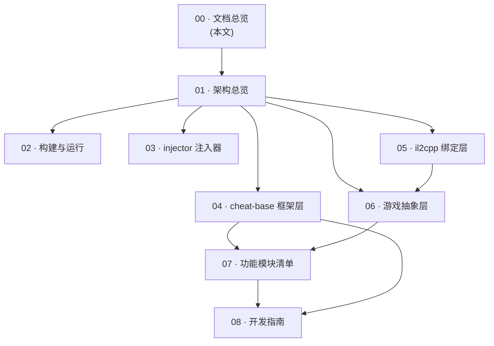

# Akebi-GC 项目文档 · 总览

> 本文档面向阅读源码、参与开发或想理解 Akebi-GC 内部原理的读者。全套文档按“由外到内、由整体到细节”的顺序组织，编号即建议的阅读顺序。

## 这是什么项目

Akebi-GC 是一个运行在 **Windows** 平台、针对 **Genshin Impact（原神）** 的游戏内存修改工具（game modification / cheat）。它的核心形态是：

- 一个被注入到游戏进程的动态库 **`CLibrary.dll`**——它挂钩（Hook）游戏的 IL2CPP 运行时函数，实现各种功能（无敌、传送、透视等）；
- 一个独立的启动/注入器 **`injector.exe`**——它以挂起方式启动游戏进程，把 DLL 注入进去，再恢复游戏运行；
- 所有功能通过一层 **ImGui 叠加界面**（游戏内按 F1 呼出）进行交互与配置。

> ⚠️ 合规提示：本项目历史上收到过 HoYoverse 的 DMCA 下架通知，最新源码已转为私有，仅发布稳定版。本仓库为一个历史快照，文档仅用于学习游戏逆向、Hook、IL2CPP 绑定等技术原理。

## 文档地图

| 编号 | 文档 | 内容概要 | 适合谁读 |
|------|------|---------|---------|
| 00 | [文档总览](./00-文档总览.md) | 项目定位、技术栈、术语表、文档导航 | 所有人（入口） |
| 01 | [架构总览](./01-架构总览.md) | 三大项目职责、依赖关系、注入→初始化→运行全生命周期 | 所有人 |
| 02 | [构建与运行](./02-构建与运行.md) | 工具链、子模块、三种构建配置、产物与运行方式 | 想编译/跑起来的人 |
| 03 | [injector 注入器](./03-injector-注入器.md) | 挂起启动游戏、父进程伪装、DLL 注入两种方式 | 关注注入原理的人 |
| 04 | [cheat-base 框架层](./04-cheat-base-框架层.md) | Feature/Manager、Config、Event、Hook、Render、工具集 | 框架开发者 |
| 05 | [il2cpp 绑定层](./05-il2cpp-绑定层.md) | 生成式绑定、静态偏移 vs 模式扫描、校验和机制 | 关注跨版本适配的人 |
| 06 | [游戏抽象层](./06-cheat-library-游戏抽象层.md) | EntityManager、Entity、Chest、过滤器体系 | 功能开发者 |
| 07 | [功能模块清单](./07-功能模块清单.md) | 全部 ~50 个功能，按模块罗列作用/Hook/配置 | 想了解具体功能的人 |
| 08 | [开发指南](./08-开发指南.md) | 如何新增一个 Feature、宏参考、编码规范 | 贡献者 |

## 技术栈一览

| 领域 | 采用的技术 |
|------|-----------|
| 语言 / 标准 | C++（C++17 特性，如 `std::filesystem`、`if constexpr`） |
| 构建 | Visual Studio 2022（v17）+ MSBuild，仅 x64 |
| 目标运行时 | Unity IL2CPP（游戏 `UserAssembly.dll` + `UnityPlayer.dll`） |
| 函数 Hook | Microsoft **Detours**（内联挂钩） |
| GUI | **Dear ImGui**（DX11 后端为主，含 DX12 后端代码） |
| 绑定代码生成 | **Il2CppInspector**（生成 `src/appdata/*` 与 `il2cpp-init.cpp`） |
| 配置序列化 | **nlohmann/json**（`cfg.json`）、注入器用 **SimpleIni**（`cfg.ini`） |
| 字符串格式化 | **fmt** |
| 枚举反射 | **magic_enum** |
| 图像加载 | **stb**（`stb_image`） |
| 进程间通信 | 命名管道（Packet Sniffer 与外部工具通信） |

第三方库均以 **git 子模块** 形式置于 `cheat-base/vendor/` 下，详见 [02 · 构建与运行](./02-构建与运行.md)。

## 术语表

理解本项目必备的概念：

| 术语 | 含义 |
|------|------|
| **IL2CPP** | Unity 的一种编译后端：把 C# 脚本 AOT 编译为原生机器码。游戏逻辑不再是可反射的托管代码，而是 `UserAssembly.dll` 里的原生函数。 |
| **偏移（Offset）** | 某个游戏函数/类型相对于模块基址的地址偏移。Akebi 通过“基址 + 偏移”定位要 Hook 的游戏函数。 |
| **Hook / 挂钩** | 用 Detours 把游戏函数的入口改写，跳转到 Akebi 的替身函数（Hook 函数），从而拦截、修改或跳过原逻辑。 |
| **CALL_ORIGIN** | 在 Hook 函数内部调用被 Hook 的“原始函数”的宏，用于放行原逻辑。 |
| **Feature** | 一个功能单元（如 GodMode）。每个 Feature 是继承自 `cheat::Feature` 的单例，自带配置字段与 GUI 绘制逻辑。 |
| **CheatManager（GenshinCM）** | 功能管理器，持有所有 Feature，负责 GUI 菜单、快捷键分发、配置档案（Profile）管理。 |
| **Config Field** | 一个可持久化、可自动生成 GUI 控件的配置字段（`config::Field<T>`），值变更时自动写入 `cfg.json`。 |
| **Event（TEvent）** | 项目自带的线程安全事件系统。最核心的是每帧触发的 `GameUpdateEvent`。 |
| **模式扫描（Pattern Scanning）** | 当写死的静态偏移与当前游戏版本不匹配时，通过特征码/交叉引用在内存中重新搜索函数地址的机制，用于跨小版本适配。 |
| **Profile / 档案** | 一套配置的集合。可为不同游戏账号（UID）绑定不同 Profile，切换账号时自动切换配置。 |
| **`app::` 命名空间** | 由 Il2CppInspector 生成的、代表游戏内 C# 类型与函数的 C++ 绑定，全部位于 `app::` 下（如 `app::GameManager`）。 |

## 关键路径速查

| 你想找… | 去这里 |
|---------|--------|
| DLL 入口 | `cheat-library/src/framework/dllmain.cpp` → `cheat-library/src/user/main.cpp` |
| 功能注册总表 | `cheat-library/src/user/cheat/cheat.cpp`（`manager.AddFeatures({...})`） |
| 偏移解析逻辑 | `cheat-library/src/framework/il2cpp-init.cpp` |
| 生成式游戏绑定 | `cheat-library/src/appdata/`（视作生成代码，勿手改） |
| 功能实现 | `cheat-library/src/user/cheat/{player,world,teleport,visuals,esp,imap,misc}/` |
| 框架/基础设施 | `cheat-base/src/cheat-base/` |
| 注入器 | `injector/src/` |
| 资源（字体/地图/图标/签名） | `cheat-library/res/` |

> 下一篇：[01 · 架构总览](./01-架构总览.md)
