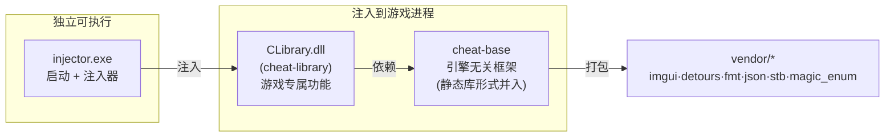
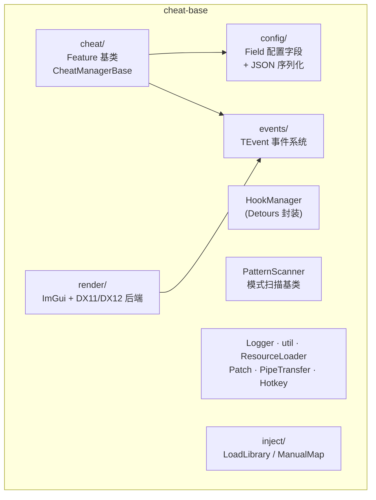
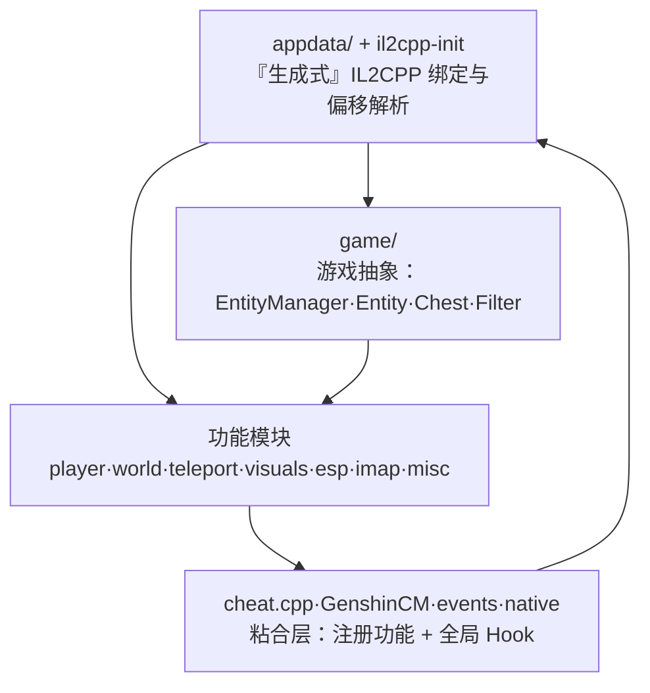
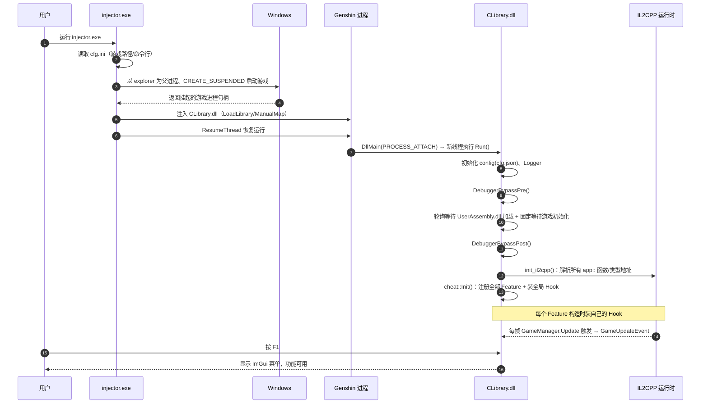
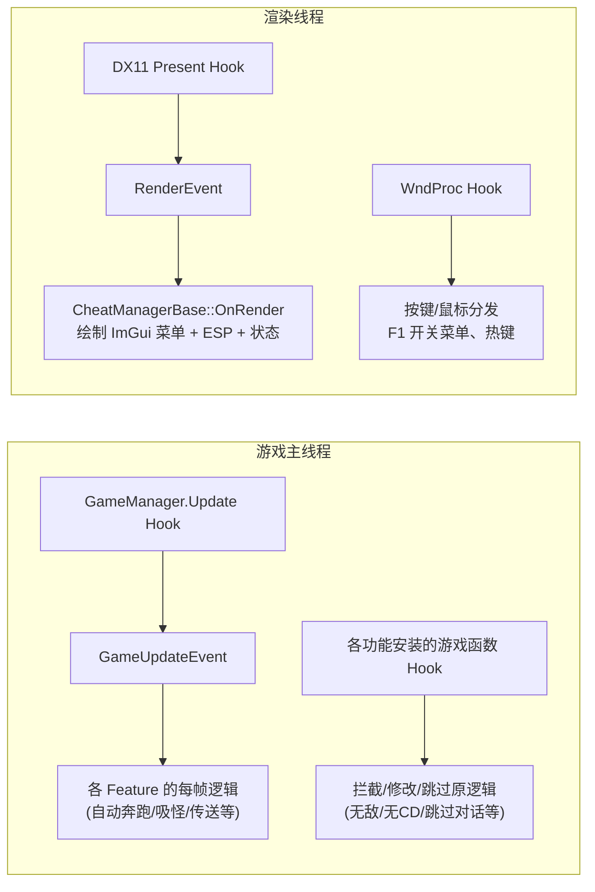
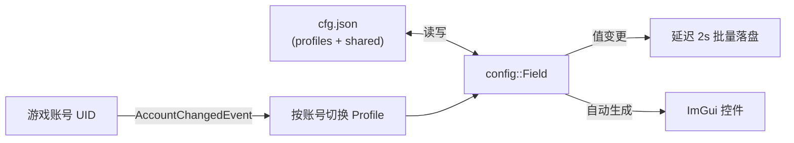

# 01 · 架构总览

> 上一篇：[00 · 文档总览](./00-文档总览.md) ｜ 下一篇：[02 · 构建与运行](./02-构建与运行.md)

本篇从宏观视角讲清楚：项目由哪几块组成、它们如何依赖、以及从“启动游戏”到“功能生效”的完整生命周期。

## 一、三大项目与职责

解决方案 `akebi-gc.sln` 包含三个 Visual Studio 项目：

| 项目 | 产物 | 职责 | 是否了解 Genshin |
|------|------|------|-----------------|
| **`cheat-base`** | 静态库/源码并入 | 引擎无关的通用框架：Feature 基类、配置系统、事件系统、Hook 管理、模式扫描、ImGui 渲染后端、日志、注入实现。并打包所有第三方库。 | ❌ 完全不了解 |
| **`cheat-library`** | `CLibrary.dll` | 真正的作弊 DLL。包含 Genshin 的 IL2CPP 绑定、游戏对象抽象、以及全部约 50 个功能。 | ✅ 深度耦合 |
| **`injector`** | `injector.exe` | 挂起启动游戏 → 注入 `CLibrary.dll` → 恢复运行。读取 `cfg.ini` 获取游戏路径等。 | ⚠️ 仅知道进程名 |

**依赖方向**：`injector` 与 `cheat-library` 都依赖 `cheat-base`；`cheat-library` 单向依赖 `cheat-base`（框架层不反向引用游戏层）。这条边界是整个项目最重要的设计约束——**任何 Genshin 专属逻辑都不应写进 `cheat-base`**。

## 二、cheat-base 内部子系统

框架层内部按职责划分为若干子系统（详见 [04 · cheat-base 框架层](./04-cheat-base-框架层.md)）：

## 三、cheat-library 内部分层

游戏层自身也是分层的：

- **绑定层（appdata）**：由 Il2CppInspector 生成，把游戏里的 C# 类型/函数暴露成 `app::*`。详见 [05](./05-il2cpp-绑定层.md)。
- **游戏抽象层（game）**：把裸的 `app::BaseEntity*` 等封装成好用的 `Entity`、`EntityManager`、过滤器体系。详见 [06](./06-cheat-library-游戏抽象层.md)。
- **功能层**：每个功能一个 Feature。详见 [07](./07-功能模块清单.md)。
- **粘合层**：`cheat.cpp` 注册所有功能、装全局 Hook；`GenshinCM` 是 Genshin 版的功能管理器；`events` 定义游戏级事件；`native` 提供调用 IL2CPP 的辅助。

## 四、完整生命周期：从双击到功能生效

这是理解整个项目运行时行为最关键的一张图。

### 关键阶段说明

1. **注入前（injector 侧）**：见 [03 · injector 注入器](./03-injector-注入器.md)。要点是用 `explorer.exe` 做父进程来规避一部分反作弊检测，并以挂起态启动，确保 DLL 在游戏逻辑跑起来之前就位。
2. **DLL 入口**：`dllmain.cpp` 在 `DLL_PROCESS_ATTACH` 时**新开一个线程**执行 `Run()`（`src/user/main.cpp`），避免在 loader lock 中做重活。
3. **等待游戏就绪**：`Run()` 会轮询直到 `UserAssembly.dll` 出现，再固定 `Sleep` 若干秒等游戏把 IL2CPP 元数据初始化完，其间前后各做一次调试器绕过（`DebuggerBypassPre/Post`）。
4. **偏移解析**：`init_il2cpp()` 把成千上万个 `app::*` 函数指针、类型信息指针填上真实地址。策略是“校验和匹配就用静态偏移，否则（在带扫描器的构建里）用模式扫描”。详见 [05](./05-il2cpp-绑定层.md)。
5. **功能注册**：`cheat::Init()` 把所有 Feature 加进 `GenshinCM`，并安装两个全局 Hook（`GameManager.Update`、移动同步）。
6. **运行时驱动**：游戏每帧调用 `GameManager.Update`，Akebi 的 Hook 借机触发 `GameUpdateEvent`——这是绝大多数功能“每帧逻辑”的心跳源。

## 五、运行时的两条主线

项目运行起来后，逻辑由两条独立主线驱动：

- **逻辑主线**（游戏线程）：`GameUpdateEvent` 每帧驱动那些需要轮询的功能；此外各功能各自 Hook 具体游戏函数来改写行为。
- **渲染主线**（渲染线程）：`cheat-base` 的 DX11 后端 Hook 了 `Present`，每帧触发 `RenderEvent`，`GenshinCM`（继承自 `CheatManagerBase`）据此绘制 ImGui 菜单、ESP 叠加层与状态信息；`WndProc` Hook 负责输入分发（F1 呼出菜单、热键触发）。

理解“两条主线 + 一个事件心跳 + 大量函数 Hook”这个模型，就抓住了整个运行时架构的骨架。

## 六、数据与配置流

- 每个 `config::Field<T>` 既是内存中的值，又绑定到 `cfg.json` 的某个节点；值一变就安排一次延迟落盘（合并写，避免频繁 IO）。
- 配置分 **profiles（每档案独有）** 与 **shared（跨档案共享）** 两棵树。
- 切换游戏账号（`AccountChangedEvent`）可自动切换到该 UID 绑定的 Profile。详见 [04 · 配置系统](./04-cheat-base-框架层.md) 与 [06](./06-cheat-library-游戏抽象层.md)。

> 下一篇：[02 · 构建与运行](./02-构建与运行.md)
