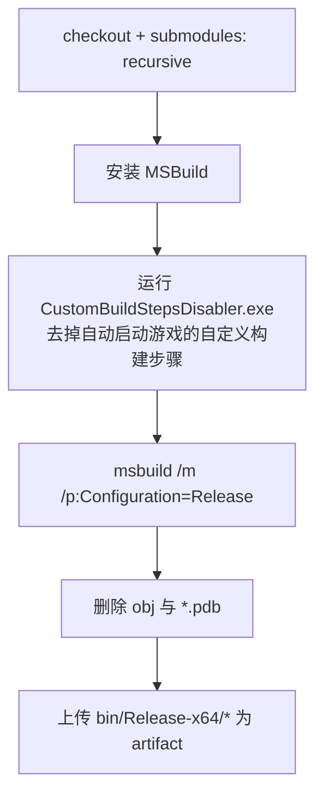
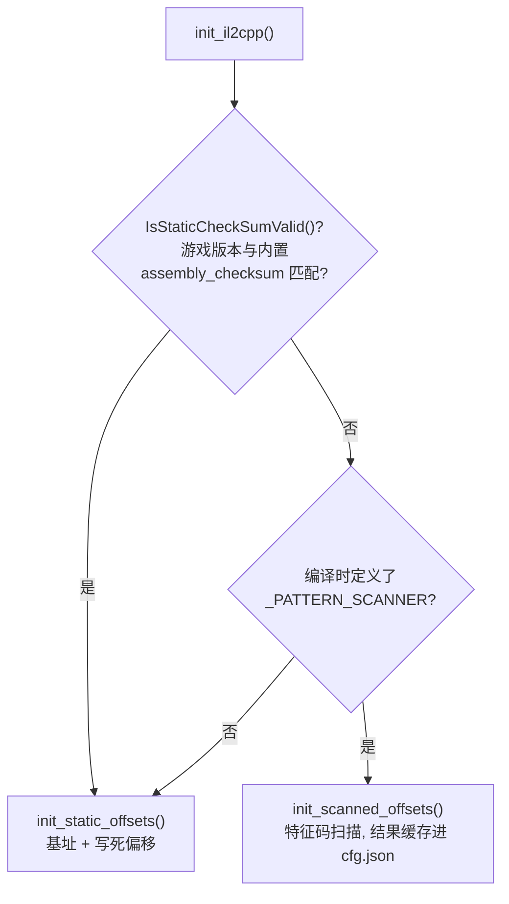

# 02 · 构建与运行

> 上一篇：[01 · 架构总览](./01-架构总览.md) ｜ 下一篇：[03 · injector 注入器](./03-injector-注入器.md)

本篇讲清楚如何编译整个项目、三种构建配置的区别、产物在哪里、以及如何运行。

## 一、前置要求

| 项 | 要求 |
|----|------|
| 操作系统 | Windows（仅支持 Windows，无跨平台构建） |
| IDE / 构建工具 | Visual Studio 2022（v17）+ MSBuild |
| 目标平台 | **x64**（见下方“平台说明”） |
| 子模块 | 必须递归拉取（第三方库全在子模块里） |

## 二、拉取源码（含子模块）

第三方依赖全部以 git 子模块形式存放于 `cheat-base/vendor/`。**只克隆主仓库是无法编译的**，必须拉取子模块：

```bash
# 克隆时直接带上子模块
git clone --recursive <repo-url>

# 或者克隆后补拉
git submodule update --init --recursive
```

子模块清单（见 `.gitmodules`）：

| 子模块 | 用途 |
|--------|------|
| `vendor/imgui` | GUI 框架（用的是带亮度修复的 fork：`CallowBlack/imgui-brightness-fix`） |
| `vendor/fmt` | 字符串格式化 |
| `vendor/json` | nlohmann/json，配置序列化 |
| `vendor/stb` | 图像加载（`stb_image`） |
| `vendor/magic_enum` | 枚举名反射（GUI 下拉框、枚举字段序列化） |
| `vendor/simpleIni` | 注入器读取 `cfg.ini` |
| `vendor/detours` | 函数 Hook（内联挂钩），注意此项并非在 `.gitmodules` 中声明，随仓库提供 |

> 提示：`detours` 目录在 `cheat-base/vendor/detours` 下随源码提供；其余为标准子模块。

## 三、构建命令

### CI 使用的命令（最权威）

CI 工作流 `.github/workflows/main.yml` 里的构建命令是：

```powershell
msbuild /m /p:Configuration=Release akebi-gc.sln
```

- `/m`：多进程并行编译。
- `/p:Configuration=Release`：选择配置（可替换为 `Debug` 或 `Release_WithScanner`）。

也可以直接在 Visual Studio 里打开 `akebi-gc.sln`，选好配置后生成解决方案。

### CI 的完整流程



其中第 3 步（`CustomBuildStepsDisabler`）很关键——见下方“⚠️ 自动启动游戏的坑”。

## 四、三种构建配置

解决方案定义了三种配置（平台维度见“平台说明”）：

| 配置 | 项目内部名 | 偏移解析方式 | 何时用 |
|------|-----------|-------------|--------|
| **Debug** | `Debug` | 静态偏移（`src/appdata/`） | 本地调试。`Run()` 会额外多等待一段时间以便附加调试器/加载游戏库。 |
| **Release** | `Release` | 静态偏移 | 正式构建、发布。 |
| **Release_WithScanner** | `Release_WS` | **模式扫描**（定义了宏 `_PATTERN_SCANNER`） | 游戏更新后静态偏移失效时，靠特征码/交叉引用在内存中重新搜索函数地址。详见 [05](./05-il2cpp-绑定层.md)。 |

> `_PATTERN_SCANNER` 宏只在 `Release_WithScanner` 配置的预处理器定义里出现（见 `cheat-library.vcxproj`）。普通 `Release`/`Debug` 不含扫描器代码，体积更小、启动更快，但无法适配已变化的偏移。

### 偏移解析的运行时决策

无论哪种配置，`init_il2cpp()` 都先校验游戏二进制的校验和：



## 五、平台说明（重要）

解决方案里虽然列出了 `x86` 与 `x64` 两种平台，但**实际只有 x64**：所有 x86 配置在 `akebi-gc.sln` 里都被映射到了对应的 x64 配置。换言之，**不存在真正的 32 位构建**。始终以 x64 编译即可。

## 六、产物与目录

- 输出目录（见 vcxproj 的 `OutDir`）：
  ```
  bin/<Configuration>-x64/
  ```
  例如 `bin/Release-x64/`。
- 中间文件目录 `IntDir`：`bin/<Configuration>-x64/obj/<ProjectName>/`。
- 运行所需的两个核心文件：`CLibrary.dll` 与 `injector.exe`，**必须放在同一目录**。

## 七、运行方式

来自 README 的使用步骤：

1. 确保 `CLibrary.dll` 与 `injector.exe` 在同一文件夹。
2. 运行 `injector.exe`（它会启动游戏并注入 DLL）。
3. 游戏登录页出现后，按 **F1** 呼出 Akebi 的 GUI。

支持的游戏进程：

| 版本 | 进程名 |
|------|--------|
| 国际服（Global） | `GenshinImpact.exe` |
| 国服（CN） | `YuanShen.exe` |

注入器首次运行会在 `cfg.ini` 里记录/询问游戏路径；如路径不对可手动修改 `cfg.ini` 的 `[Inject] GenshinPath`。DLL 侧的功能配置则保存在 `cfg.json`。

## 八、⚠️ 自动启动游戏的坑

`cheat-library` 项目配置了**自定义构建步骤 / PostBuildEvent**：构建完成后会自动执行 `injector.exe` 并 `sleep` 一段时间（见 vcxproj 中的 `<Command>"$(OutDir)injector.exe" ... powershell ... sleep</Command>`）。这意味着：

- **本地每次编译成功后会自动尝试拉起游戏**——如果你不想这样，请在 `cheat-library` 项目上禁用该自定义构建步骤。
- CI 环境用一个专门的 `CustomBuildStepsDisabler.exe` 工具在构建前移除这些步骤，避免在 Runner 上误启动游戏。

## 九、没有的东西

为避免误解，明确说明本仓库**不包含**：

- 单元测试 / 测试运行器；
- Lint / 静态检查配置；
- 除 MSBuild 外的其它构建系统（无 CMake / Makefile）。

“验证是否正确”只能靠实际注入游戏后手动测试功能。

## 十、资源文件（编译进 DLL）

`cheat-library/res/` 下的资源通过 `res.rc` 编入 `CLibrary.dll`：

| 资源 | 说明 |
|------|------|
| `Ruda-Bold.ttf` / `Ruda-ExtraBold.ttf` | ImGui 字体 |
| `map_*.json` | 各地图（提瓦特/渊下宫/金苹果群岛/地下矿区）的交互地图数据 |
| `icons/` `iconsHD/` | 交互地图与 ESP 用的图标集 |
| `signatures.json` | 模式扫描用的特征码/交叉引用签名 |
| `assembly_checksum.json` | 用于判断当前游戏版本是否与内置偏移匹配 |
| `ascension_materials.json` | 突破材料数据 |

`res/scripts/` 下的 Python 脚本（`icon_downloader.py`、`load_map_data.py`、`saved_offsets_to_static.py` 等）用于**离线再生**这些资源数据，不参与编译。

> 下一篇：[03 · injector 注入器](./03-injector-注入器.md)
