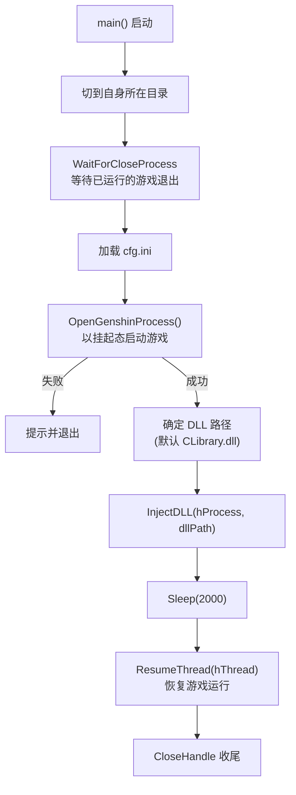
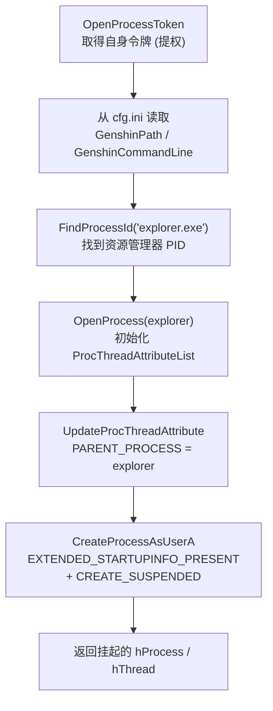
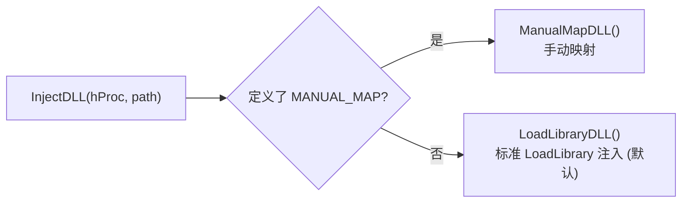
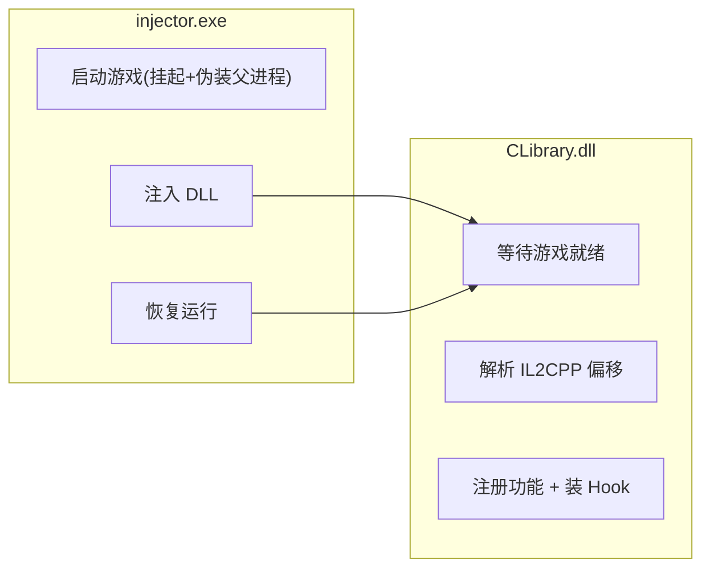

# 03 · injector 注入器

> 上一篇：[02 · 构建与运行](./02-构建与运行.md) ｜ 下一篇：[04 · cheat-base 框架层](./04-cheat-base-框架层.md)

`injector.exe` 是一个独立的小型可执行程序，唯一职责是：**把游戏拉起来，并让 `CLibrary.dll` 在游戏逻辑运行之前进入游戏进程**。本篇讲清它的完整流程与两种注入方式。

- 源码目录：`injector/src/`
- 关键文件：`main.cpp`（主流程）、`injector.cpp`（注入分派）、`util.cpp`（进程工具）
- 实际注入实现来自框架层：`cheat-base/src/cheat-base/inject/`

## 一、整体流程



对应 `injector/src/main.cpp` 的 `main()`。

## 二、启动前：确保干净环境

`main()` 开头调用两次 `WaitForCloseProcess`（`util.cpp:35`），分别针对国际服与国服进程名：

```
GenshinImpact.exe   // Global
YuanShen.exe        // CN
```

逻辑（`util.cpp`）：

- `FindProcessId` 通过 `CreateToolhelp32Snapshot` 快照遍历进程表按名字找 PID。
- 若游戏已在运行，则**等待其退出**再继续（Debug 构建下会额外 `taskkill /F` 强杀）。
- 之后 `Sleep(1000)` 等待相关 DLL 卸载干净。

目的是保证注入的是一个全新的、由注入器自己以挂起态启动的游戏进程。

## 三、核心：以挂起态 + 伪装父进程启动游戏

这是注入器最有讲究的一步，位于 `main.cpp` 的 `OpenGenshinProcess()`：



要点解释：

| 步骤 | 为什么这么做 |
|------|-------------|
| `OpenProcessToken(..., TOKEN_ALL_ACCESS)` | 取得当前进程令牌，用 `CreateProcessAsUserA` 启动子进程。 |
| **父进程设为 `explorer.exe`** | 通过 `PROC_THREAD_ATTRIBUTE_PARENT_PROCESS` 把新游戏进程的父进程伪装成资源管理器，使其“看起来像用户正常双击启动”，规避一部分基于父进程链的反作弊/检测。 |
| **`CREATE_SUSPENDED`** | 游戏进程创建后立即挂起，主线程不运行。这样注入器可以在游戏任何逻辑执行前完成 DLL 注入，确保 Hook 时机足够早。 |
| `cfg.ini` 中的路径/命令行 | 游戏可执行路径与启动命令行都从 `cfg.ini` 的 `[Inject]` 段读取；找不到路径时会弹文件选择框让用户指定并回写 `cfg.ini`。 |

## 四、注入 DLL

启动挂起后，`main()` 决定要注入的 DLL 路径（默认 `CLibrary.dll`，可由命令行参数覆盖），然后调用 `InjectDLL`。

- Debug 构建下会先把 DLL 复制到系统临时目录再注入（便于重编译时不锁定原文件）。
- Release 构建直接注入当前目录的 DLL。

`InjectDLL`（`injector/src/injector.cpp`）按编译宏在**两种注入方式**间二选一：



### 方式一：LoadLibrary 注入（默认）

实现见 `cheat-base/src/cheat-base/inject/load-library.cpp`，经典远程线程手法：

1. 取 `kernel32.dll` 里 `LoadLibraryA` 的地址。
2. 在目标进程 `VirtualAllocEx` 分配内存，`WriteProcessMemory` 写入 DLL 路径字符串。
3. `CreateRemoteThread` 让目标进程以该路径为参数调用 `LoadLibraryA`——即由游戏进程自己加载我们的 DLL。
4. 等待远程线程结束后释放临时内存。

DLL 一旦被加载，其 `DllMain`（`DLL_PROCESS_ATTACH`）就会触发，进入 [01 · 生命周期](./01-架构总览.md#四完整生命周期从双击到功能生效) 描述的 `Run()` 流程。

### 方式二：手动映射（Manual Map）

实现见 `cheat-base/src/cheat-base/inject/manual-map.cpp`。手动映射绕过 `LoadLibrary`，自行完成 PE 头解析、分配、重定位、导入表处理等，因而模块不会出现在标准模块列表里，更隐蔽。需在编译时定义 `MANUAL_MAP` 宏启用。

## 五、恢复运行

注入完成后：

```cpp
Sleep(2000);            // 给 DLL 加载与线程创建留出时间
ResumeThread(hThread);  // 恢复游戏主线程，游戏正式开跑
CloseHandle(hProcess);
```

此时游戏开始正常初始化，而 `CLibrary.dll` 的 `Run()` 已在另一线程中等待 `UserAssembly.dll` 就绪，准备解析偏移并注册功能。

## 六、注入器与 DLL 的分工



注入器**不关心**任何 Genshin 功能细节，只负责“把 DLL 送进去并让游戏跑起来”。所有游戏交互都在 DLL 内完成。

## 七、相关：调试器绕过

与注入配套的是 DLL 侧的 `DebuggerBypassPre()` / `DebuggerBypassPost()`（`cheat-library/src/user/cheat/debugger.cpp`），在 `Run()` 中偏移解析前后各调用一次。本仓库中这两个函数的**具体实现为空/私有**（源码注释写明 “implementation is private for now”）。Debug 构建下会提示：未实现反调试绕过时，附加 VS 调试器会导致游戏崩溃。

> 下一篇：[04 · cheat-base 框架层](./04-cheat-base-框架层.md)
