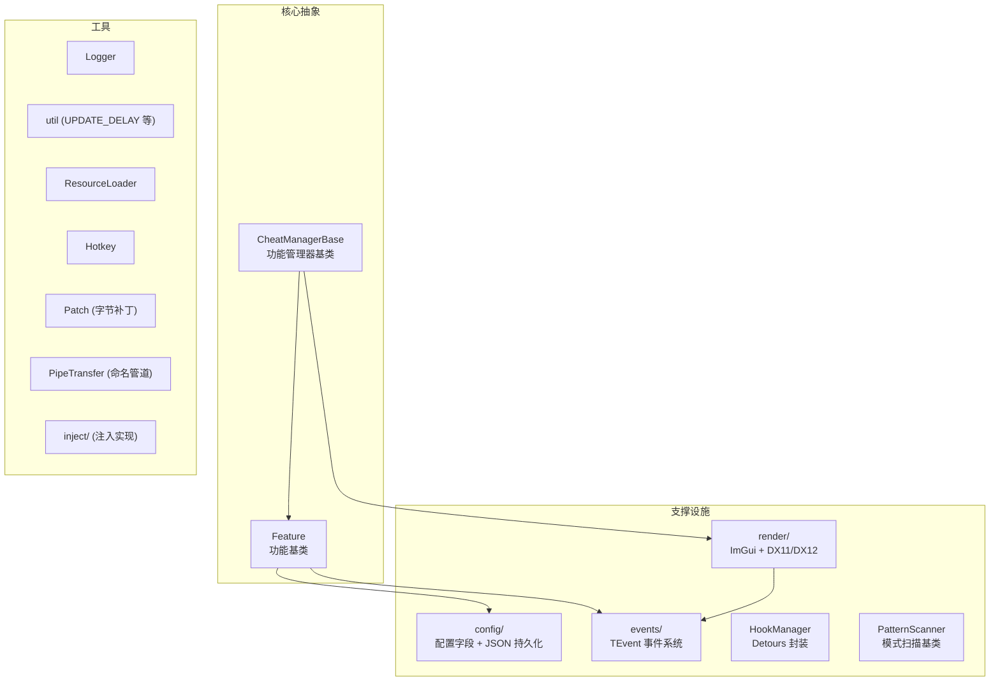
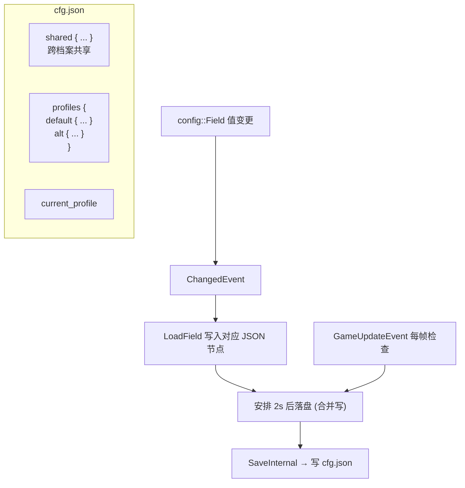
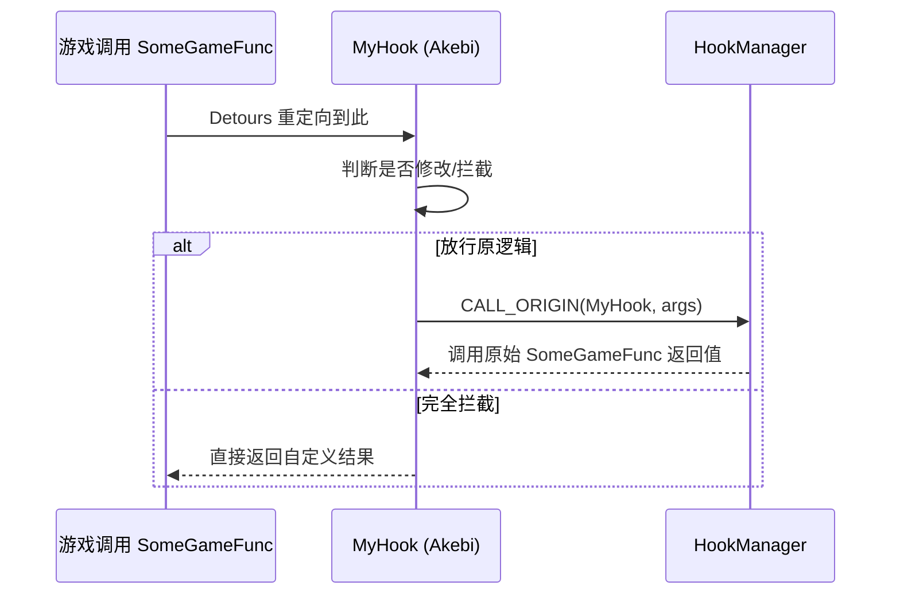
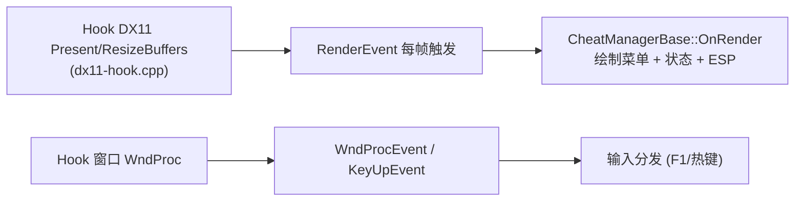

# 04 · cheat-base 框架层

> 上一篇：[03 · injector 注入器](./03-injector-注入器.md) ｜ 下一篇：[05 · il2cpp 绑定层](./05-il2cpp-绑定层.md)

`cheat-base` 是整个项目的**引擎无关框架**——它不知道 Genshin 的存在，只提供“做一个带 GUI、可配置、能 Hook 的游戏修改器”所需的通用基础设施。理解它，就理解了所有功能赖以运行的地基。

- 源码目录：`cheat-base/src/cheat-base/`
- 设计约束：**不得包含任何 Genshin 专属逻辑**（那些属于 `cheat-library`）。

## 一、子系统全景



## 二、Feature：功能基类

`cheat/Feature.h` 定义了所有功能的统一接口——一个极简的抽象基类：

```cpp
class Feature {
public:
    virtual const FeatureGUIInfo& GetGUIInfo() const = 0; // 归属哪个 GUI 模块
    virtual void DrawMain() = 0;                           // 在菜单里画自己的控件
    virtual bool NeedStatusDraw() const { return false; }  // 是否画屏幕状态
    virtual void DrawStatus() { }
    virtual bool NeedInfoDraw() const { return false; }    // 是否画信息面板
    virtual void DrawInfo() { }
    virtual void DrawExternal() { }                        // 画屏幕叠加层(如 ESP)
protected:
    Feature() { };
};
```

`FeatureGUIInfo { name, moduleName, isGroup }` 中的 `moduleName`（如 `"Player"`、`"World"`）决定该功能落到 GUI 的哪个标签页。

**约定**：每个具体 Feature 都是**单例**——私有构造函数里安装自己的 Hook，`GetInstance()` 返回静态单例。详见 [08 · 开发指南](./08-开发指南.md)。

## 三、CheatManagerBase：功能管理器

`cheat/CheatManagerBase.h/.cpp` 是功能的容器与 GUI 驱动核心。Genshin 版的 `GenshinCM` 继承它（见 [06](./06-cheat-library-游戏抽象层.md)）。

职责：

| 职责 | 相关成员 |
|------|---------|
| 收集功能 | `AddFeature` / `AddFeatures`，存入 `m_Features` 并按 `moduleName` 归类到 `m_FeatureMap` |
| 决定标签页顺序 | `SetModuleOrder` → `m_ModuleOrder` |
| 绘制菜单 | `OnRender` → `DrawMenu` → `DrawMenuSection`，遍历各功能的 `DrawMain()` |
| 输入分发 | `OnKeyUp` / `OnWndProc`，处理 F1 开关菜单、热键触发（`CheckToggles`） |
| 档案管理 | `DrawProfile*` 一系列虚函数，供 `GenshinCM` 扩展账号绑定 |
| 输入锁 | 菜单打开时 `renderer::SetInputLock` 屏蔽游戏按键 |

初始化时它把自己挂到三个渲染层事件上（`CheatManagerBase.cpp:15`）：

```cpp
void CheatManagerBase::Init(...) {
    renderer::Init(pFontData, dFontDataSize, dxVersion);
    events::RenderEvent  += MY_METHOD_HANDLER(CheatManagerBase::OnRender);
    events::KeyUpEvent   += MY_METHOD_HANDLER(CheatManagerBase::OnKeyUp);
    events::WndProcEvent += MY_METHOD_HANDLER(CheatManagerBase::OnWndProc);
}
```

于是 GUI 与输入完全由渲染后端的事件驱动。

## 四、配置系统（config/）

这是框架里最精巧的子系统：**声明一个字段，就同时得到「内存值 + 自动持久化 + 自动生成 GUI 控件」**。

### 4.1 Field —— 会自动存盘的值

`config::Field<T>`（`config/Field.h` → `internal/FieldBase.h`）包裹一个类型为 `T` 的值。它：

- 可像普通变量一样读写（重载了 `operator=` 和到 `T` 的隐式转换）；
- 知道自己的**友好名 / 存储名 / 所属 section / 是否共享**；
- 值变更时触发 `ChangedEvent`，由 `Config.cpp` 监听并安排落盘。

### 4.2 声明字段的宏

字段通常在 Feature 构造函数的初始化列表里用宏创建（`config/Config.h`）：

| 宏 | 含义 |
|----|------|
| `NF(field, name, section, default)` | 最常用。非共享字段。 |
| `NFS(...)` | shared=true，跨档案共享。 |
| `NFEX(field, friendName, name, section, default, shared)` | 完整参数版（可分别指定友好名与存储名）。 |
| `NFP / NFPS`（`NFPB` 系列） | 带额外构造参数（如枚举、Toggle）。 |
| `SNF*` 系列 | 与上面对应，但直接返回构造好的字段（用于非成员场景）。 |

例（来自 GodMode）：

```cpp
GodMode::GodMode() : Feature(),
    NFEX(f_Enabled, "God mode", "m_GodMode", "Player", false, false) { ... }
```

### 4.3 特化字段类型

`config/fields/` 提供了增强字段：

| 类型 | 作用 |
|------|------|
| `config::Toggle<Hotkey>` | 一个“开关 + 绑定热键”的复合字段——功能既能在菜单点开关，也能用快捷键切换。**这是最常见的 `f_Enabled` 类型。** |
| `config::Enum<E>` | 枚举字段，借 `magic_enum` 自动在 GUI 生成下拉框、在 JSON 里存枚举名。 |

### 4.4 持久化与档案（Config.cpp）



关键设计（`config/Config.cpp`）：

- **两棵树**：非共享字段存进 `profiles/<当前档案>`，共享字段存进 `shared`。
- **section 支持层级**：section 名里的 `::` 会被拆成嵌套 JSON 节点。
- **延迟批量落盘**：字段一变不立刻写盘，而是记录一个 2 秒后的时间戳；`SetupUpdate(&GameUpdateEvent)` 把落盘检查挂到每帧更新上，到点才真正写 `cfg.json`，避免频繁 IO。
- **档案切换**：`ChangeProfile` 只重载“非共享字段”，共享字段保持不变，并触发 `ProfileChanged` 事件。

## 五、事件系统（events/）

`events/event.hpp` 提供线程安全的 `TEvent<Params...>`（源自 ZolotovPavel/EventHandling）：

```cpp
TEvent<> GameUpdateEvent;          // 无参事件
someEvent += FUNCTION_HANDLER(fn); // 订阅普通函数
someEvent += MY_METHOD_HANDLER(Cls::method); // 订阅成员函数
someEvent(args...);                // 触发，依次调用所有订阅者
someEvent -= handler;              // 退订
```

特性：

- **线程安全**：内部用 `std::shared_mutex`，且 `HandlerRunner` 在遍历订阅者时正确处理“回调中途增删订阅者”的情况。
- **`TCancelableEvent`**：在参数尾部追加一个 `bool&`，任一订阅者置真即“取消”，返回值告知调用方是否被取消——用于像 `KeyUpEvent` 这种“可拦截”的场景。

事件系统是解耦利器：配置落盘、GUI 渲染、输入分发、各功能的每帧逻辑，全部通过订阅事件而非硬编码调用来接线。

## 六、Hook 管理（HookManager）

`HookManager.h` 是对 **Microsoft Detours** 的极简模板封装：

```cpp
// 安装：把 func 重定向到 handler，并记录 handler→原始func 的映射
HookManager::install(app::SomeGameFunc, MyHook);

// 在 Hook 内部调用原始函数
CALL_ORIGIN(MyHook, args...);   // 展开为 HookManager::call(MyHook, __func__, args...)

// 卸载
HookManager::detach(MyHook);
HookManager::detachAll();
```

实现要点（`HookManager.h`）：

- `install` → `enable` 内部走 Detours 的 `DetourTransactionBegin/Attach/Commit`。
- 用一张 `holderMap`（`handler 指针 → 原始函数指针`）保存原始地址；`CALL_ORIGIN` 宏借 `__func__` 反查原始函数并调用。
- 若映射里找不到原始函数（竞态/未安装），`call` 返回 `RType()` 并告警，而非崩溃。



## 七、模式扫描（PatternScanner）

`PatternScanner.h/.cpp` 是**引擎无关**的特征码扫描基类：在模块内存里按签名搜索地址、计算模块哈希/时间戳、校验模块完整性。Genshin 专属的 IL2CPP 扫描逻辑由 `cheat-library` 里的 `ILPatternScanner` 继承实现——详见 [05 · il2cpp 绑定层](./05-il2cpp-绑定层.md)。

## 八、渲染后端（render/）

`render/renderer.h` + `render/backend/` 负责把 ImGui 画到游戏画面上：



- 默认使用 **D3D11** 后端（`renderer::DXVersion::D3D11`），仓库也带有 **D3D12** 后端代码（`dx12-hook.cpp`）。
- `renderer` 还管理字体（按大小取不同 `ImFont`、全局缩放）与**输入锁**（菜单打开时用 `AddInputLocker`/`SetInputLock` 屏蔽游戏输入）。
- `ImageLoader` 用 stb 把图片解码成纹理，供 ESP/交互地图/头像等使用；`gui-util` 提供 `ConfigWidget` 等把 `config::Field` 直接渲染成控件的辅助函数。

## 九、工具集

| 文件 | 作用 |
|------|------|
| `Logger.h/.cpp` | 分级日志（`LOG_DEBUG/INFO/WARNING/ERROR`、`LOG_LAST_ERROR`），支持控制台与文件双输出。 |
| `util.h/.cpp` | 通用工具：时间戳、字符串分割、路径处理，以及节流宏 **`UPDATE_DELAY(ms)`**（限制某段每帧逻辑的最小执行间隔）。 |
| `ResourceLoader.h/.cpp` | 从 DLL 资源段加载字体、地图、图标、签名等（`Load` / `LoadEx`）。 |
| `Hotkey.h/.cpp` | 热键抽象：捕获、匹配、序列化，是 `Toggle<Hotkey>` 的基础。 |
| `Patch.h/.cpp` | 直接的字节码补丁（在内存里改写指令）。 |
| `PipeTransfer.h/.cpp` | 命名管道传输，供 Packet Sniffer 与外部工具通信。 |
| `thread-safe.h` | 线程安全容器/工具。 |
| `globals.h/.cpp` | 全局状态。 |
| `inject/` | `LoadLibraryDLL` 与 `ManualMapDLL` 两种注入实现（被 `injector` 复用，见 [03](./03-injector-注入器.md)）。 |

## 小结

`cheat-base` 给出了一套“**事件驱动 + 声明式配置 + 模板化 Hook + ImGui 叠加**”的通用骨架。`cheat-library` 只需：继承 `Feature` 写功能、用宏声明配置、用 `HookManager::install` 挂游戏函数、订阅 `GameUpdateEvent` 跑每帧逻辑——其余全部由框架代劳。

> 下一篇：[05 · il2cpp 绑定层](./05-il2cpp-绑定层.md)
