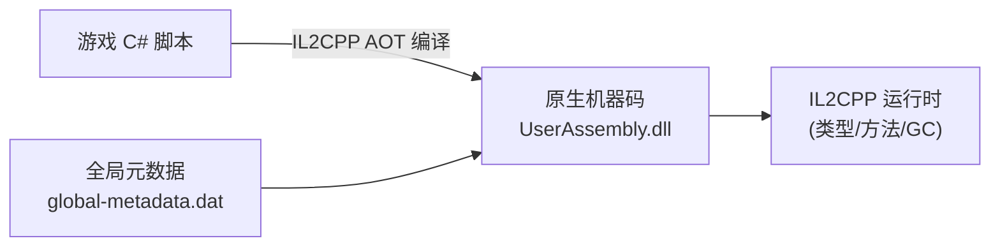
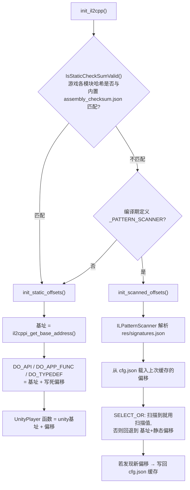
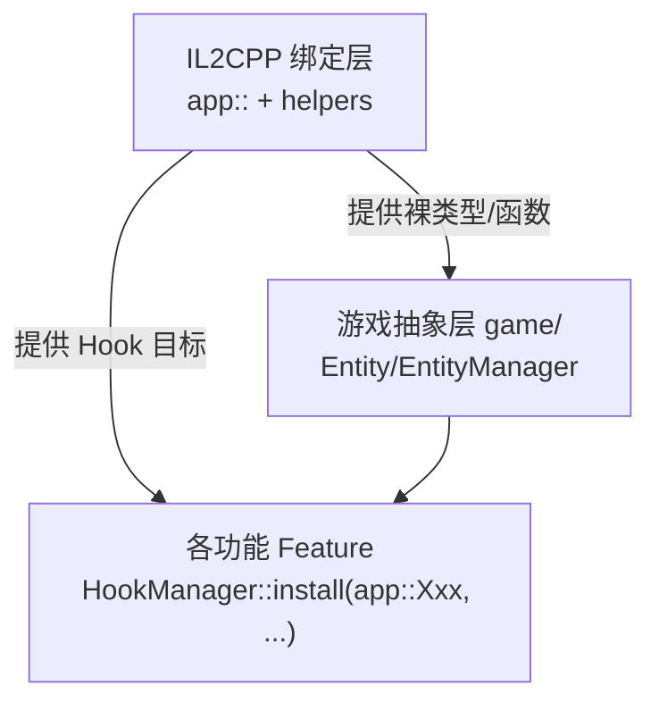
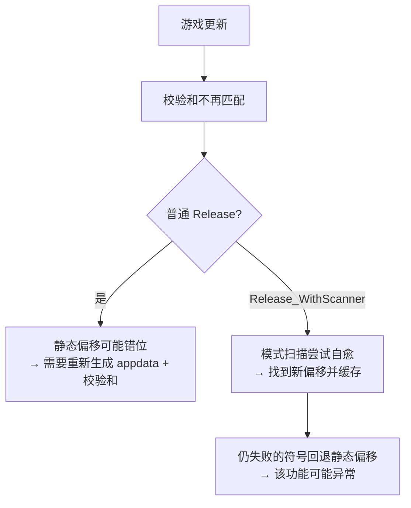

# 05 · IL2CPP 绑定层

> 上一篇：[04 · cheat-base 框架层](./04-cheat-base-框架层.md) ｜ 下一篇：[06 · 游戏抽象层](./06-cheat-library-游戏抽象层.md)

这一层解决一个核心问题：**Genshin 是 Unity IL2CPP 游戏，游戏逻辑是编译后的原生机器码，如何在 C++ 里“调用/Hook 游戏里的 C# 函数、访问 C# 对象字段”？** 答案是——用工具生成一套 C++ 绑定，再在运行时把它们“连线”到内存中的真实地址。

- 相关目录：`cheat-library/src/appdata/`、`cheat-library/src/framework/`
- 关键文件：`il2cpp-init.cpp`（偏移解析）、`helpers.h`（容器/宏）、`ILPatternScanner.h/.cpp`（模式扫描）

## 一、背景：什么是 IL2CPP



- Unity 的 IL2CPP 后端把 C# 提前编译成原生代码，游戏逻辑位于 `UserAssembly.dll`，Unity 引擎位于 `UnityPlayer.dll`。
- 没有托管反射可用，但类型/方法的元信息仍在，且函数在模块里有固定（相对基址的）偏移。
- 因此思路是：**用 Il2CppInspector 从游戏二进制里导出所有类型/方法，生成 C++ 声明，运行时再把这些声明的函数指针指向“基址 + 偏移”。**

## 二、生成式绑定文件（appdata/）

`src/appdata/` 下的文件**由 Il2CppInspector 自动生成**（文件头都标注了 “Generated C++ file by Il2CppInspector”）。**请把它们当作生成产物，不要手改。**

| 文件 | 内容 |
|------|------|
| `il2cpp-types.h` | 所有游戏类型（`app::GameManager`、`app::BaseEntity` 等）的 C++ 结构体定义，含字段布局。 |
| `il2cpp-types-ptr.h` | 各类型的 TypeInfo 指针声明。 |
| `il2cpp-functions.h` | 所有游戏方法的函数指针声明（`app::` 命名空间下）。 |
| `il2cpp-api-functions.h` / `il2cpp-api-functions-ptr.h` | IL2CPP 运行时 API（`il2cpp_thread_attach`、`il2cpp_domain_get` 等）。 |
| `il2cpp-unityplayer-functions.h` | 来自 `UnityPlayer.dll` 的函数。 |
| `il2cpp-metadata-version.h` | 元数据版本号（影响某些指针的判定方式）。 |

配套的 `src/framework/`：

| 文件 | 内容 |
|------|------|
| `il2cpp-appdata.h` | 汇总包含上述 appdata 头，供全项目 `#include`。 |
| `il2cpp-init.cpp/.h` | **偏移解析核心**（下一节）。 |
| `helpers.h/.cpp` | 手写的辅助层：容器包装、类型转换、向量运算、字符串转换、单例访问宏等。 |
| `pch-il2cpp.h` | 预编译头。 |

### X-Macro 技巧

绑定文件用了 **X-Macro** 模式：同一份 `il2cpp-functions.h` 被包含多次，每次配合不同的 `DO_APP_FUNC` 宏定义，分别用于「声明函数指针」和「给函数指针赋真实地址」。例如（`il2cpp-init.cpp`）：

```cpp
// 第一次：声明
#define DO_APP_FUNC(a, r, n, p) r (*n) p
#include "il2cpp-functions.h"     // → 生成一堆 app::Xxx 函数指针变量
#undef DO_APP_FUNC

// 第二次：赋址
#define DO_APP_FUNC(a, r, n, p) n = (r (*) p)(baseAddress + a)
#include "il2cpp-functions.h"     // → 把每个指针指向 基址+偏移
#undef DO_APP_FUNC
```

这样成千上万个函数只需维护一份清单，声明与赋址逻辑各写一遍即可。

## 三、偏移解析：init_il2cpp()

这是本层最重要的运行时逻辑（`il2cpp-init.cpp`）。`Run()` 在等到游戏就绪后调用它。



### 3.1 静态偏移（默认路径）

`init_static_offsets()`：取模块基址，把每个 `app::*` 函数指针、TypeInfo 指针、UnityPlayer 函数直接赋值为 `基址 + 编译期写死的偏移`。**快、无额外开销**，但前提是游戏二进制版本与内置偏移完全对得上。

### 3.2 校验和守门（IsStaticCheckSumValid）

`IsStaticCheckSumValid()` 读取资源里的 `AssemblyChecksums`（`res/assembly_checksum.json`），逐模块比对哈希：

- 匹配 → 认为“静态偏移可信”，走静态路径。
- 不匹配 → 说明游戏更新了、偏移可能失效，告警并（在带扫描器的构建里）转走模式扫描。

它还用一个 `PatternScanner` 字段缓存各模块时间戳，避免重复计算哈希。

### 3.3 模式扫描（仅 Release_WithScanner）

`init_scanned_offsets()` 只在编译定义了 `_PATTERN_SCANNER` 时启用：

1. 从资源加载 `Signatures`（`res/signatures.json`）——里面是函数/类型/交叉引用的特征签名。
2. 用 `ILPatternScanner` 解析签名，并从 `cfg.json` 的 `OffsetData` 字段载入上次扫描缓存。
3. 对每个符号执行 `SELECT_OR(...)`：**扫描到有效地址就用扫描值，否则回退到 `基址 + 静态偏移`**。
4. 若本次发现了以前没有的偏移（`scanner.IsUpdated()`），把结果写回 `cfg.json` 缓存，并提示重启游戏以获得最稳定效果。

这套机制让工具在游戏出小更新、偏移轻微变动时仍能自愈，而无需立刻重新生成整套绑定。

## 四、ILPatternScanner：IL2CPP 专属扫描器

`ILPatternScanner`（`cheat-library/src/user/cheat/ILPatternScanner.h`）继承自框架层的 `PatternScanner`（[04](./04-cheat-base-框架层.md#七模式扫描patternscanner)），把通用的“内存找特征码”能力特化到 IL2CPP：

- `SearchAPI` / `SearchTypeInfo` / `SearchMethodInfo`：分别定位 IL2CPP API、类型信息、方法信息。
- 直接解析 IL2CPP 的**全局元数据**：内置了一份 `ModifiedMetadataHeader` 结构（元数据头的字段布局）与 `MetadataInfo`，用于遍历类型定义、方法定义、方法指针表等。
- 通过重建 “Inspector 风格的类名/方法名” 来把签名名字映射到内存地址（`ComputeInspectorClassName` / `ComputeInspectorMethodName`）。
- 扫描结果可 `SaveJson`/`LoadJson` 与 `cfg.json` 往返，形成缓存。

一句话：它是“在没有静态偏移可信时，靠元数据 + 特征码把 `app::*` 重新连回内存地址”的兜底方案。

## 五、helpers.h：让绑定好用起来

生成的绑定是“裸”的，`helpers.h` 补上了一层手写便利设施：

### 5.1 访问单例与静态字段

```cpp
auto pm = GET_SINGLETON(MoleMole_PlayerModule); // 取游戏单例(带加载判定)
GET_STATIC_FIELDS(SomeClass);                    // 取某类的静态字段(先确保类已初始化)
```

### 5.2 异常保护（SEH）

游戏内存随时可能是半初始化状态，直接读会崩。用 SEH 宏包住高危读写：

```cpp
SAFE_BEGIN();
// ... 访问游戏对象字段 ...
SAFE_ERROR();   // 捕获异常并 LOG_WARNING
return nullptr;
SAFE_END();
// 或简写：SAFE_EEND();
```

### 5.3 IL2CPP 容器包装

C# 的 `List<T>`、`T[]`、`Dictionary<K,V>`、`LinkedList<T>` 在内存里有固定布局，`helpers.h` 用模板结构体 `UniList<T>` / `UniArray<T>` / `UniDict<K,V>` / `UniLinkList<T>` 把它们包成可 `begin()/end()` 迭代、可 `.vec()`/`.pairs()` 导出的 C++ 容器：

```cpp
auto listRaw = SomeGameCall();
auto list = TO_UNI_LIST(listRaw, app::BaseComponent*);
for (auto& c : *list) { ... }
```

### 5.4 类型安全转换与数学

- `CastTo<T>(pObject, pClass)`：仅当对象的 `klass` 与目标类一致时才转换，否则返回 `nullptr`（类似 C# 的 `as`）。
- 为 `app::Vector2` / `app::Vector3` 重载了 `+ - * /`、取模、求方向等，写传送/吸怪/自由相机等空间计算时非常方便。
- `il2cppi_to_string` / `string_to_il2cppi`：C++ `std::string` 与游戏 `Il2CppString`/`app::String` 互转。
- `il2cppi_get_base_address` / `il2cppi_get_unity_address`：取 `UserAssembly.dll` 与 `UnityPlayer.dll` 的基址。

## 六、这一层与上下层的关系



- **向上**：游戏抽象层（[06](./06-cheat-library-游戏抽象层.md)）在裸绑定之上封装出好用的 `Entity`、`EntityManager`。
- **对功能**：每个功能都直接用 `app::` 里的函数名作为 `HookManager::install` 的 Hook 目标（见 [07](./07-功能模块清单.md) 里各功能的 Hook 点）。

## 七、跨游戏版本更新时会发生什么



因此发布通常提供两种构建：普通版（快，需版本严格匹配）与带扫描器版（可容忍小更新）。彻底适配大版本更新则需要用 Il2CppInspector 对新游戏二进制**重新生成 `appdata/` 与 `assembly_checksum.json`**。

> 下一篇：[06 · 游戏抽象层](./06-cheat-library-游戏抽象层.md)
