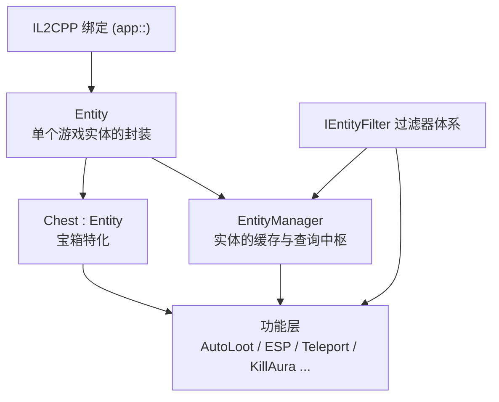
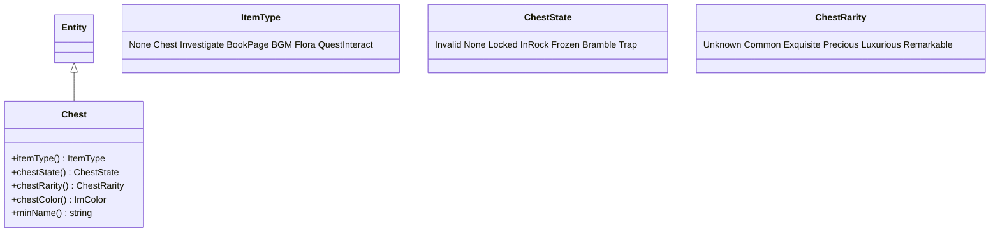
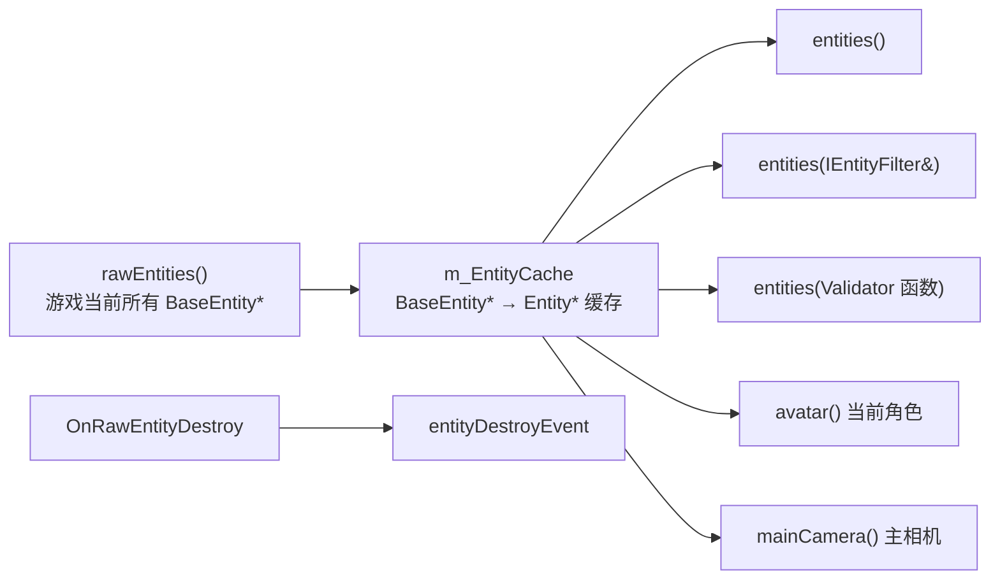
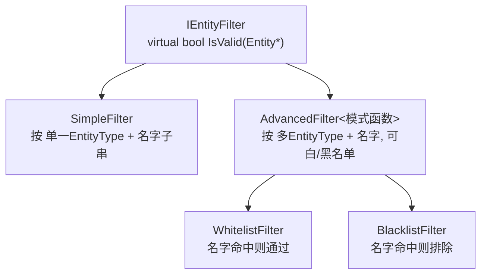
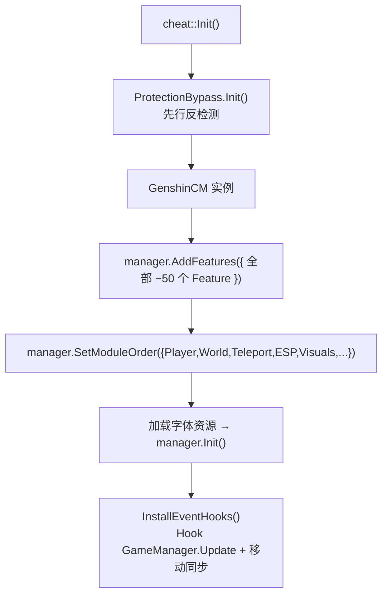

# 06 · 游戏抽象层（game/）

> 上一篇：[05 · il2cpp 绑定层](./05-il2cpp-绑定层.md) ｜ 下一篇：[07 · 功能模块清单](./07-功能模块清单.md)

[05](./05-il2cpp-绑定层.md) 让我们能拿到裸的 `app::BaseEntity*` 等游戏对象，但直接操作它们既繁琐又易崩。**游戏抽象层**把这些裸指针封装成一套好用、安全、可组合的 C++ 对象与查询接口，供上层功能复用。

- 目录：`cheat-library/src/user/cheat/game/`
- 另含粘合层：`cheat.cpp`、`GenshinCM`、`events`、`native`

## 一、分层定位



绝大多数“世界类/传送类/透视类”功能都建立在 `EntityManager + Filter` 之上。

## 二、Entity：单个实体的封装

`game/Entity.h` 把一个 `app::BaseEntity*` 包成对象，屏蔽了裸指针的复杂访问：

| 能力 | 方法 |
|------|------|
| 身份 | `name()`、`runtimeID()`、`type()` |
| 分类判定 | `isGadget()`、`isChest()`、`isAvatar()`、`isLoaded()` |
| 位置 | `relativePosition()`、`absolutePosition()`、`levelPosition()`，及对应 setter |
| 距离 | 多个 `distance(...)` 重载（对点/对关卡坐标/对另一实体） |
| 朝向 | `forward()/back()/right()/left()/up()/down()` |
| 组件 | `moveComponent()`、`combat()`、`gameObject()`、`rigidbody()`、`animator()` |
| 逻辑插件 | 模板方法 `plugin<T>(pClass)` |

### 亮点：`plugin<T>()` 与 SEH 保护

Genshin 的实体由多个“逻辑组件（LogicComponent）+ 插件（Plugin）”拼装。`Entity::plugin<T>()` 遍历实体的所有逻辑组件与其插件列表，用 `CastTo<T>` 找出目标类型的插件——整段访问包在 `SAFE_BEGIN()/SAFE_END()`（[05 §5.2](./05-il2cpp-绑定层.md#52-异常保护seh)）里，即使实体内存半初始化也不会让游戏崩溃。这让功能能安全地拿到诸如战斗、移动等子系统插件。

## 三、Chest：宝箱特化

`game/Chest.h` 继承 `Entity`，专门表达“宝箱/可调查物”的语义，用三个枚举描述宝箱：



- `chestRarity()`：普通/精致/珍贵/华丽/珍稀。
- `chestState()`：是否上锁、封岩、冰封、荆棘缠绕、陷阱等。
- 结果用 `std::optional` 惰性缓存（只算一次）。
- `chestColor()` 供 ESP / 宝箱指示器按稀有度着色。

宝箱传送（`ChestTeleport`）与宝箱指示器（`ChestIndicator`）都基于它。

## 四、EntityManager：实体查询中枢

`game/EntityManager.h` 是单例，负责“**把游戏当前所有实体，按需过滤后交给功能**”，并做缓存与生命周期管理。



核心接口：

| 接口 | 作用 |
|------|------|
| `instance()` | 取单例。 |
| `rawEntities()` | 返回当前所有裸实体。 |
| `entities()` | 返回封装后的全部 `Entity*`。 |
| `entities(const IEntityFilter&)` | **按过滤器查询**（最常用）。 |
| `entities(Validator)` | 用函数指针自定义谓词查询。 |
| `entity(app::BaseEntity*)` / `entity(runtimeID)` | 由裸指针/运行时 ID 取封装实体。 |
| `avatar()` | 当前操控角色。 |
| `mainCamera()` | 主相机实体（ESP 投影、自由相机等要用）。 |
| `entityDestroyEvent` | 实体销毁事件，供功能清理引用。 |

**缓存设计**：`m_EntityCache`（`BaseEntity* → {Entity*, runtimeID}`）避免每帧为同一实体重复 new 封装对象；`m_EntityCacheLock` 保证多线程安全。

## 五、过滤器体系（Filter）

这是抽象层最强大的部分——用**声明式、可组合**的过滤器描述“我要哪些实体”，配合 `EntityManager::entities(filter)` 即可。

### 5.1 接口与两种实现



- **`IEntityFilter`**（`IEntityFilter.h`）：只有一个 `bool IsValid(Entity*)`。
- **`SimpleFilter`**（`SimpleFilter.h`）：匹配某个 `EntityType` + 一组名字子串；还能由一组子 filter 组合构造。
- **`AdvancedFilter<nameFilterFn>`**（`AdvancedFilter.h`）：模板参数决定名字匹配策略——
  - `WhitelistFilter`：名字包含任一模式即通过；
  - `BlacklistFilter`：名字包含任一模式即排除。
  - 支持多类型集合，且重载了 `operator+` 可把两个同类过滤器**合并**（类型集合与名字集合取并）。

匹配逻辑（`AdvancedFilter::IsValid`）：先看实体类型是否落在允许集合（空集=不限），再按白/黑名单策略比对名字子串。

### 5.2 预定义过滤器目录（filters.h）

`game/filters.h` 在 `cheat::game::filters` 下预先声明了**上百个**开箱即用的过滤器，按语义分组，功能层直接引用：

| 命名空间 | 覆盖内容（示例） |
|----------|-----------------|
| `chest` | 各稀有度宝箱、埋藏箱、上锁/冰封/荆棘等状态 |
| `collection` | 书籍、观景点、木箱、地脉之石、辉光晶石、书页等 |
| `equipment` | 圣遗物、各类武器（弓/双手剑/法器/长柄/单手剑） |
| `featured` | 神瞳（风/岩/雷/草）、绯红玉髓、共鸣海螺、掉落物等 |
| `guide` | 篝火火把、昼夜机关、渊下宫相位之门、神秘刻文等引导物 |
| `living` | 各种生物：鱼、蟹、鸟、狐狸、NPC、掉落肉等 |
| `mineral` | 各种矿石与其掉落（紫晶块、水晶块、铁块、夜泊石…） |
| `monster` | 极其丰富的怪物名录（丘丘人、遗迹机关、深渊法师、各类 BOSS…） |
| `plant` | 各种植物/食材（苹果、薄荷、清心、绝云椒椒…） |
| `puzzle` | 解谜相关（岩造物、机关、封印、各类塞莱……含若干白名单型） |
| `combined` | **组合入口**：Oculies（所有神瞳）、Chests、Ores、Animals、Monsters、MonsterBosses 等聚合过滤器 |

这样一来，例如“吸取所有矿石”只需引用 `filters::combined::Ores`，“传送到最近的岩造物”引用相应过滤器即可，无需功能自己硬编码实体名。

### 5.3 CacheFilterExecutor

`game/CacheFilterExecutor.h/.cpp` 提供“带缓存的过滤执行器”，避免每帧对同一批过滤器重复全量扫描实体，用于像交互地图、ESP 这类需要持续查询大量实体的场景做性能优化。

## 六、粘合层（cheat.cpp / GenshinCM / events / native）

抽象层之上还有把一切接起来的粘合代码：

### 6.1 cheat.cpp —— 注册与全局 Hook

`cheat::Init()`（`cheat.cpp`）是功能装配总入口：



- `AddFeatures({...})` 是**所有功能的注册总表**（见 [07](./07-功能模块清单.md)）。
- `SetModuleOrder({...})` 决定 GUI 标签页顺序：Player→World→Teleport→ESP→Visuals→Hotkeys→Settings→About→Debug。
- `InstallEventHooks()` 装两个全局 Hook：
  - `GameManager.Update` → 每帧触发 `GameUpdateEvent`，并顺带 `CheckAccountChanged()` 检测账号切换（触发 `AccountChangedEvent`）；
  - `LevelSyncCombatPlugin.RequestSceneEntityMoveReq` → 触发 `MoveSyncEvent`（移动同步，供 KillAura 等使用）。

### 6.2 GenshinCM —— Genshin 版功能管理器

`GenshinCM`（`GenshinCM.h`，继承自 `CheatManagerBase`，见 [04 §3](./04-cheat-base-框架层.md#三cheatmanagerbase功能管理器)）在通用管理器上增加了 **Genshin 的账号 ↔ 配置档案绑定**：


- `AccountConfig` 保存 `uid→昵称`、`uid→profile`、`profile→uids` 等映射，随 `cfg.json` 持久化（用 `NLOHMANN_DEFINE_TYPE_*` 定义序列化）。
- 可在 GUI 里把某账号“绑定”到某档案；切号时自动套用对应配置。
- 还负责光标可见性（`CursorSetVisibility`）等与游戏输入相关的实现。

### 6.3 events / native

- `events.h/.cpp`：定义游戏级事件 `GameUpdateEvent`、`AccountChangedEvent`、`MoveSyncEvent`（基于 [04 §5](./04-cheat-base-框架层.md#五事件系统events) 的 `TEvent`）。这些是功能层的“心跳”与信号源。
- `native.h/.cpp`：调用 IL2CPP 的底层辅助（如线程附加、原生调用约定处理等）。

## 七、一个功能如何用到这一层（示例思路）

以“自动拾取范围内掉落物”为例，典型写法：

```cpp
// 每帧（订阅 GameUpdateEvent）
auto& manager = game::EntityManager::instance();
auto avatar = manager.avatar();
for (auto e : manager.entities(filters::combined::AnimalPickUp)) {
    if (avatar->distance(e) < f_Range)
        // ...触发拾取交互...
}
```

即：`EntityManager` 出实体 → `filters` 选目标 → `Entity` 算距离/位置 → 调游戏函数执行。功能本身几乎不碰裸 `app::` 指针。

> 下一篇：[07 · 功能模块清单](./07-功能模块清单.md)
