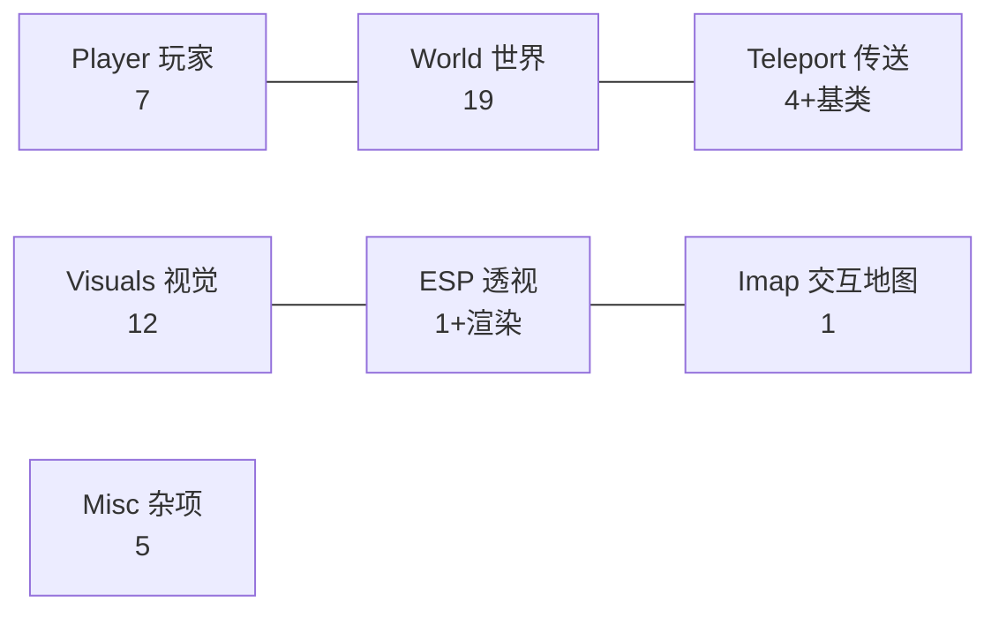
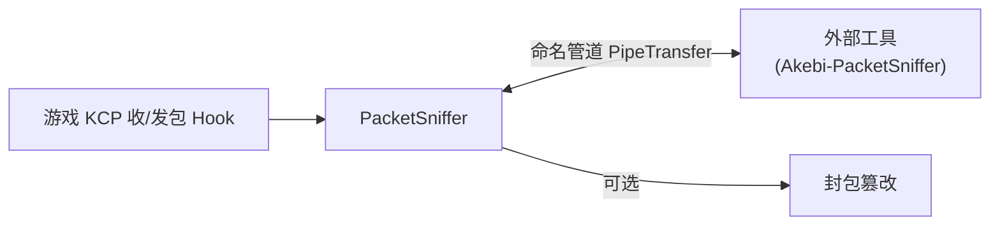

# 07 · 功能模块清单

> 上一篇：[06 · 游戏抽象层](./06-cheat-library-游戏抽象层.md) ｜ 下一篇：[08 · 开发指南](./08-开发指南.md)

本篇按 GUI 模块罗列全部功能（Feature）。每个功能给出：**作用、主要 Hook 点、关键配置字段**。所有功能都在 `cheat-library/src/user/cheat/cheat.cpp` 的 `manager.AddFeatures({...})` 里注册，源码分布在对应模块子目录下。

> 阅读提示：
> - “Hook 点”列的是该功能通过 `HookManager::install(app::XXX, ...)` 挂钩的游戏函数（省略 `app::` 前缀）；“—”表示不直接 Hook，而是靠订阅 `GameUpdateEvent` 每帧轮询实现。
> - `f_Enabled` 的类型多为 `Toggle<Hotkey>`（开关 + 可绑热键），下文不再重复说明。
> - GUI 标签页顺序：**Player → World → Teleport → ESP → Visuals → Hotkeys → Settings → About → Debug**。

## 模块概览

---

## 一、Player（玩家）· `player/`

| 功能 | 作用 | 主要 Hook 点 | 关键配置 |
|------|------|-------------|---------|
| **GodMode** | 无敌：免疫所有伤害（含坠落、环境伤害） | `VCHumanoidMove_NotifyLandVelocity`、`Miscs_CheckTargetAttackable`、`ActorAbilityPlugin_HanlderModifierThinkTimerUp` | `f_Enabled` |
| **InfiniteStamina** | 无限体力，支持“数据包替换”模式 | `DataItem_HandleNormalProp` | `f_Enabled`、`f_PacketReplacement` |
| **NoCD** | 消除技能/爆发/冲刺/弓箭蓄力冷却 | `LCAvatarCombat_IsEnergyMax`、`LCAvatarCombat_IsSkillInCD_1`、`HumanoidMoveFSM_CheckSprintCooldown`、`ActorAbilityPlugin_AddDynamicFloatWithRange` | `f_AbilityReduce`、`f_Sprint`、`f_InstantBow`、`f_UtimateMaxEnergy`、`f_TimerReduce` |
| **NoClip** | 穿墙移动，支持速度模式/自由飞行/相机相关移动 | `HumanoidMoveFSM_LateTick` | `f_Enabled`、`f_Speed`、`f_CameraRelative`、`f_VelocityMode`、`f_FreeflightMode` |
| **RapidFire** | 攻击增强：多击、多目标、倍速动画、秒杀 | `VCAnimatorEvent_HandleProcessItem`、`LCBaseCombat_FireBeingHitEvent` | `f_Enabled`、`f_MultiHit`、`f_Multiplier`、`f_OnePunch`、`f_MultiTarget`、`f_AttackSpeed` |
| **AutoRun** | 自动奔跑（朝摄像机方向持续移动） | —（每帧逻辑） | `f_Enabled`、`f_Speed` |
| **FallControl** | 坠落时仍可水平操控方向 | —（每帧逻辑） | `f_Enabled`、`f_Speed` |

---

## 二、World（世界）· `world/`

功能最多的模块，涵盖自动化采集、战斗辅助、环境修改三类。

### 自动化 / 采集

| 功能 | 作用 | 主要 Hook 点 | 关键配置 |
|------|------|-------------|---------|
| **AutoLoot** | 自动拾取掉落物 + 自动开宝箱 | `LCSelectPickup_AddInteeBtnByID`、`LCSelectPickup_IsInPosition`、`LCSelectPickup_IsOutPosition` | `f_AutoPickup`、`f_AutoTreasure`、`f_UseCustomRange`、`f_DelayTime`、`f_CustomRange` |
| **VacuumLoot** | 把掉落物吸向玩家 | —（每帧逻辑） | `f_Enabled`、`f_Distance`、`f_Radius`、`f_DelayTime` |
| **AutoDestroy** | 自动破坏矿石/盾牌/杂物 | `LCAbilityElement_ReduceModifierDurability` | `f_DestroyOres`、`f_DestroyShields`、`f_DestroyDoodads`、`f_Range` |
| **AutoTreeFarm** | 自动砍范围内的树 | —（每帧逻辑） | `m_Enabled`、`m_AttackDelay`、`m_RepeatDelay`、`m_AttackPerTree`、`m_Range` |
| **AutoSeelie** | 自动跟随/收集塞莱（含静电塞莱） | —（每帧逻辑） | `f_Enabled`、`f_ElectroSeelie` |
| **AutoFish** | 自动钓鱼，支持自动重新抛竿 | `FishingModule_*`（抛竿/咬钩/开始/结束/退出等多点） | `f_Enabled`、`f_DelayBeforeCatch`、`f_AutoRecastRod` |
| **AutoCook** | 自动烹饪 + 快速熟练度 | `PlayerModule_RequestPlayerCook`、`PlayerModule_OnPlayerCookRsp`、`CookingQtePageContext_UpdateProficiency` | `f_Enabled`、`f_FastProficiency`、`f_QualityField` |
| **AutoChallenge** | 自动完成时间挑战（可炸桶销毁） | —（每帧逻辑） | `f_Enabled`、`f_BombDestroy`、`f_Range` |

### 战斗辅助

| 功能 | 作用 | 主要 Hook 点 | 关键配置 |
|------|------|-------------|---------|
| **KillAura** | 秒杀光环：崩溃/百分比/秒杀多种伤害模式 | `BaseMoveSyncPlugin_ConvertSyncTaskToMotionInfo` | `f_Enabled`、`f_DamageMode`、`f_PercentDamageMode`、`f_InstantDeathMode`、`f_Range`、`f_DamageValue` |
| **MobVacuum** | 把怪物/动物吸到玩家前方 | —（每帧逻辑） | `f_Enabled`、`f_IncludeMonsters`、`f_IncludeAnimals`、`f_Speed`、`f_Radius` |
| **DumbEnemies** | 敌人变呆（不释放技能/不攻击） | `VCMonsterAIController_TryDoSkill` | `f_Enabled` |
| **FreezeEnemies** | 冻结敌人（停止动画与移动） | —（每帧逻辑） | `f_Enabled` |

### 环境 / 世界修改

| 功能 | 作用 | 主要 Hook 点 | 关键配置 |
|------|------|-------------|---------|
| **ElementalSight** | 常驻元素视野（移动时保持） | `LevelSceneElementViewPlugin_Tick` | `f_Enabled` |
| **FakeTime** | 固定游戏内时间 | `LevelTimeManager_SetInternalTimeOfDay` | `f_Enabled`、`f_TimeHour`、`f_TimeMinute` |
| **GameSpeed** | 游戏整体加速 | —（每帧逻辑） | `f_Enabled`、`f_Speed`、`f_Hotkey` |
| **CustomWeather** | 自定义天气，可召唤闪电攻击敌人 | —（每帧逻辑） | `f_Enabled`、`f_WeatherType`、`f_Lightning` |
| **DialogSkip** | 跳过/加速对话、自动选择、跳过过场 | `InLevelCutScenePageContext_UpdateView`/`ClearView`、`CriwareMediaPlayer_Update` | `f_Enabled`、`f_AutoSelectDialog`、`f_FastDialog`、`f_CutsceneUSM`、`f_TimeSpeedup` |
| **OpenTeamImmediately** | 立即打开队伍（跳过倒计时） | `InLevelMainPageContext_DoTeamCountDown_*_MoveNext`、`InLevelPlayerProfilePageContext_SetupView`/`ClearView` | `f_Enabled` |
| **MusicEvent** | 音乐玩法完美演奏（最高分/完美连击） | `MusicGamePlayComponent_OnMiss`、`set_combo` 等多点 | `f_Enabled` |

> 注：`MusicEvent` 未在当前 `cheat.cpp` 的注册表中启用（源码存在），其余 World 功能均已注册。

---

## 三、Teleport（传送）· `teleport/`

| 功能 | 作用 | 主要 Hook 点 | 关键配置 |
|------|------|-------------|---------|
| **MapTeleport** | 点击大地图任意点传送（可自动探测落点高度） | `InLevelMapPageContext_OnMapClicked`/`OnMarkClicked`、`LoadingManager_NeedTransByServer`/`PerformPlayerTransmit`、`BaseEntity_SetAbsolutePosition` | `f_Enabled`、`f_DefaultHeight`、`f_DetectHeight` |
| **ChestTeleport** | 传送到最近宝箱（按稀有度/状态筛选） | —（基于 EntityManager + 过滤器） | 多个 `f_FilterChest*` 筛选字段 |
| **OculiTeleport** | 传送到最近神瞳 | —（继承 `ItemTeleportBase`） | 继承基类配置 |
| **CustomTeleports** | 自定义传送点列表，可保存文件、自动循环 | —（每帧逻辑） | `f_Enabled`、`f_Speed`、`f_DelayTime` |
| *ItemTeleportBase* | （基类）通用“传送到某类物品”框架，被 Oculi/Chest 传送复用 | — | — |

`ChestTeleport`/`OculiTeleport` 的“找最近目标”能力直接构建在 [06 · EntityManager + Filter](./06-cheat-library-游戏抽象层.md#五过滤器体系filter) 之上。

---

## 四、Visuals（视觉）· `visuals/`

| 功能 | 作用 | 主要 Hook 点 | 关键配置 |
|------|------|-------------|---------|
| **FreeCamera** | 自由相机（移动/旋转/FOV，可锁输入） | —（每帧逻辑 + 相机实体） | `f_Enabled`、`f_Speed`、`f_FOV`、`f_BlockInput` |
| **CameraZoom** | 自定义第三人称相机距离 | `SCameraModuleInitialize_SetWarningLocateRatio` | `f_Enabled`、`f_Zoom` |
| **FPSUnlock** | 解锁帧率上限 | —（改设置值） | `f_Enabled`、`f_Fps` |
| **NoFog** | 移除雾效 | —（每帧逻辑） | `f_Enabled` |
| **HideUI** | 隐藏游戏 UI（隐藏 UICamera） | —（每帧逻辑） | `f_Enabled` |
| **ChestIndicator**（ShowChestIndicator） | 显示隐藏宝箱/机制指示 | `LCIndicatorPlugin_DoCheck` | `f_Enabled` |
| **PaimonFollow** | 派蒙实时跟随角色 | —（每帧逻辑） | `f_Enabled` |
| **EnablePeeking** | 启用窥视（查看被遮挡内容） | —（每帧逻辑） | — |
| **AnimationChanger** | 替换角色动画状态 | `PlayerModule_EntityAppear` | `f_Enabled`、`f_Animation`、`f_Delay` |
| **ProfileChanger** | 修改本地显示的个人资料（UID/昵称/等级/头像/名片） | —（改本地数据/记录回调） | `f_Enabled`、`f_UID`、`f_NickName`、`f_Level`、`f_Avatar` |
| **TextureChanger** | 替换角色头/身/服饰/滑翔翼贴图 | —（资源替换） | `f_Enabled`、`f_HeadPath`、`f_BodyPath`、`f_DressPath` |
| **Browser** | 游戏内嵌入式浏览器（在 3D 平面上显示网页） | —（渲染扩展） | `f_Enabled`、`f_planeWidth`、`f_planeHeight` |

---

## 五、ESP（透视）· `esp/`

| 组件 | 作用 |
|------|------|
| **ESP**（Feature） | 实体透视：在屏幕上为实体绘制方框/盒子、名称、距离、追踪线等。支持大量按类别的开关与配色。 |
| **ESPItem** | 单类目标的 ESP 配置数据（颜色、热键、启用状态），用于配置序列化。 |
| **ESPRender** | ESP 的实际屏幕绘制逻辑（世界坐标→屏幕投影，画框/线/文字）。 |

主要配置：`f_Enabled`、`f_DrawBoxMode`（矩形/立体盒）、`f_DrawTracerMode`（追踪线）、`f_DrawDistance`、`f_DrawName`、`f_Range`。ESP 通过 `Feature::DrawExternal()` 在渲染事件中叠加绘制，数据源为 [06 · EntityManager + Filter](./06-cheat-library-游戏抽象层.md)。

---

## 六、Imap（交互地图）· `imap/`

| 功能 | 作用 | 主要 Hook 点 | 关键配置 |
|------|------|-------------|---------|
| **InteractiveMap** | 在游戏大地图/小地图上叠加资源点（宝箱、材料、神瞳等），支持完成标记、自动发现新点、自定义点、位置修正 | `GadgetModule_OnGadgetInteractRsp`、`InLevelMapPageContext_UpdateView`/`ZoomMap`、`MonoMiniMap_Update` | `f_Enabled`、`f_IconSize`、`f_ShowCompleted`、`f_AutoDetectNewItems`、`f_CompleteNearestPoint` |

地图底图与点位数据来自资源里的 `map_*.json` 与 `icons/`（见 [02 §10](./02-构建与运行.md#十资源文件编译进-dll)）。

---

## 七、Misc（杂项）· `misc/`

| 功能 | 作用 | 主要 Hook 点 | 关键配置 |
|------|------|-------------|---------|
| **ProtectionBypass** | 反检测绕过（在功能注册前 `Init()` 先行） | 拦截用户数据记录相关调用（`OnRecordUserData`） | `f_Enabled` |
| **Settings** | 全局设置（日志开关、语言、界面等）；`Run()` 用它决定是否文件/控制台日志 | — | `f_FileLogging`、`f_ConsoleLogging` 等（定义于 `cheat-base` 的 `Settings`） |
| **Hotkeys** | 快捷键总览/配置面板 | — | — |
| **Debug** | 调试工具：实体查看器、位置信息、传送调试等 | — | 含 `TeleportCondition`、`EntitySortCondition` 枚举 |
| **About** | 关于/信息面板 | — | — |
| **PacketSniffer**（`misc/sniffer/`） | 抓取/操纵游戏网络封包，经命名管道与外部工具通信 | `KcpClient_TryDequeueEvent`（收包）、`KcpNative_kcp_client_send_packet`（发包） | `f_CaptureEnabled`、`f_ManipulationEnabled`、`f_PipeName` |

### PacketSniffer 数据流

封包通过 `misc/sniffer/pipe/`（`PipeClient` + `PipeIO` + `messages/*`）序列化后经命名管道传给独立的 [Akebi-PacketSniffer](https://github.com/Akebi-Group/Akebi-PacketSniffer) 工具展示/分析。

---

## 注册总表位置

以上功能的启用与否，以 `cheat-library/src/user/cheat/cheat.cpp` 中 `manager.AddFeatures({...})` 列表为准。新增功能后必须在此登记才会生效——具体步骤见 [08 · 开发指南](./08-开发指南.md)。

> 下一篇：[08 · 开发指南](./08-开发指南.md)
