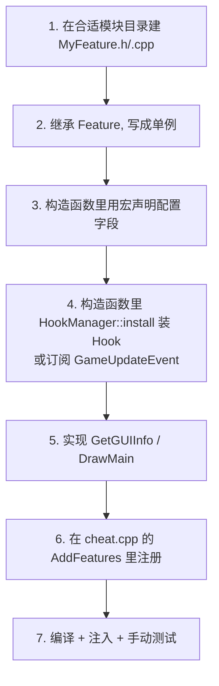
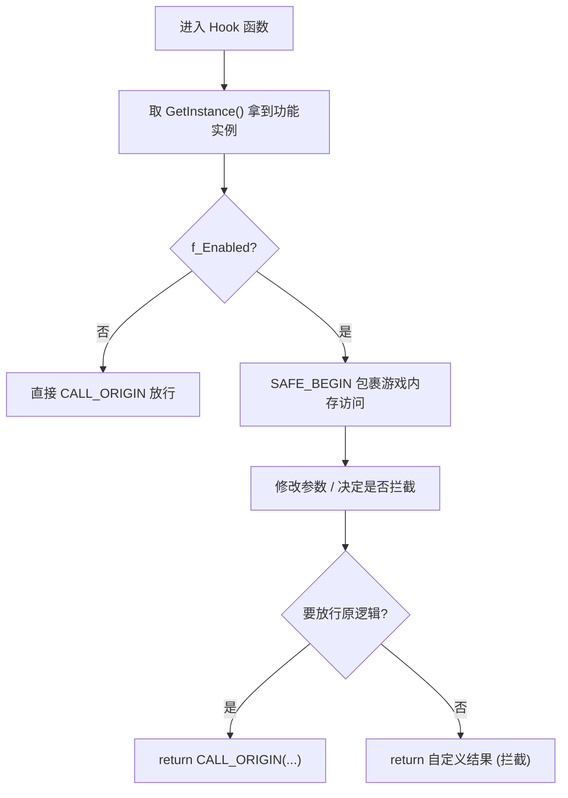
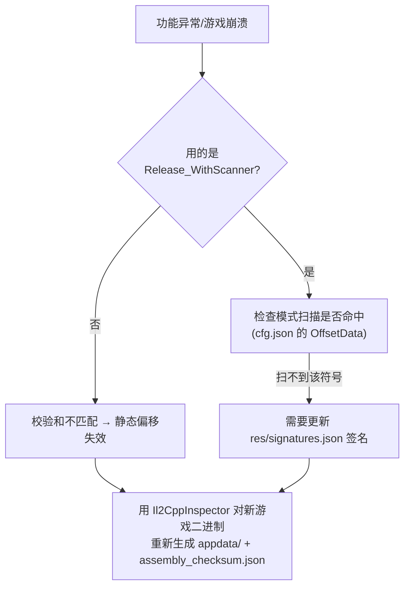

# 08 · 开发指南

> 上一篇：[07 · 功能模块清单](./07-功能模块清单.md) ｜ 返回：[00 · 文档总览](./00-文档总览.md)

本篇面向贡献者，讲清楚**如何新增一个功能**、**有哪些宏可用**、以及**编写 Hook 与代码的约定**。建议先读完 [04 框架层](./04-cheat-base-框架层.md)、[05 绑定层](./05-il2cpp-绑定层.md)、[06 游戏抽象层](./06-cheat-library-游戏抽象层.md)。

## 一、新增一个 Feature（完整流程）

以新增一个名为 `MyFeature` 的世界类功能为例。



### 1）选目录

按功能语义放进对应模块目录（决定它出现在哪个 GUI 标签页）：

```
cheat-library/src/user/cheat/{player,world,teleport,visuals,esp,imap,misc}/
```

### 2）头文件：单例 + 继承 Feature

```cpp
// world/MyFeature.h
#pragma once
#include <cheat-base/cheat/Feature.h>
#include <cheat-base/config/config.h>

namespace cheat::feature
{
    class MyFeature : public Feature
    {
    public:
        config::Field<config::Toggle<Hotkey>> f_Enabled;
        config::Field<float> f_Range;

        static MyFeature& GetInstance();

        const FeatureGUIInfo& GetGUIInfo() const override;
        void DrawMain() override;

        bool NeedStatusDraw() const override;  // 可选
        void DrawStatus() override;            // 可选

    private:
        MyFeature();                            // 私有构造 → 单例
        static void SomeGameFunc_Hook(app::SomeType* __this, MethodInfo* method); // 若需 Hook
        void OnGameUpdate();                    // 若需每帧逻辑
    };
}
```

### 3）源文件：构造、配置、Hook、GUI

```cpp
// world/MyFeature.cpp
#include "pch-il2cpp.h"
#include "MyFeature.h"

#include <helpers.h>
#include <cheat/events.h>
#include <cheat/game/EntityManager.h>

namespace cheat::feature
{
    MyFeature::MyFeature() : Feature(),
        // 用 NFEX 宏声明字段：字段变量, 友好名, 存储名, section, 默认值, 是否共享
        NFEX(f_Enabled, "My feature", "m_MyFeature", "World", false, false),
        NF(f_Range, "Range", "World", 15.0f)
    {
        // 方式 A：Hook 某个游戏函数
        HookManager::install(app::SomeType_SomeGameFunc, SomeGameFunc_Hook);

        // 方式 B：需要每帧逻辑就订阅 GameUpdateEvent
        events::GameUpdateEvent += MY_METHOD_HANDLER(MyFeature::OnGameUpdate);
    }

    MyFeature& MyFeature::GetInstance()
    {
        static MyFeature instance;
        return instance;
    }

    const FeatureGUIInfo& MyFeature::GetGUIInfo() const
    {
        // { 名称(留空则用控件名), 所属模块, 是否为分组 }
        static const FeatureGUIInfo info{ "", "World", false };
        return info;
    }

    void MyFeature::DrawMain()
    {
        ConfigWidget("My Feature", f_Enabled, "这里写鼠标悬停提示，说明功能作用。\n");
        ConfigWidget("Range", f_Range, 0.1f, 1.0f, 100.0f, "作用范围。");
    }

    bool MyFeature::NeedStatusDraw() const { return f_Enabled; }
    void MyFeature::DrawStatus() { ImGui::Text("MyFeature"); }

    void MyFeature::OnGameUpdate()
    {
        if (!f_Enabled) return;

        UPDATE_DELAY(200); // 节流：最多每 200ms 执行一次

        SAFE_BEGIN();
        auto& manager = game::EntityManager::instance();
        auto avatar = manager.avatar();
        if (avatar == nullptr) return;
        // ... 用 EntityManager + filters 做事 ...
        SAFE_EEND();
    }

    void MyFeature::SomeGameFunc_Hook(app::SomeType* __this, MethodInfo* method)
    {
        auto& self = GetInstance();
        if (self.f_Enabled) {
            // 修改行为，或直接 return 拦截
        }
        CALL_ORIGIN(SomeGameFunc_Hook, __this, method); // 放行原逻辑
    }
}
```

### 4）注册到 cheat.cpp

在 `cheat-library/src/user/cheat/cheat.cpp`：

```cpp
#include <cheat/world/MyFeature.h>   // 顶部加 include
// ...
manager.AddFeatures({
    // ... 既有功能 ...
    FEAT_INST(MyFeature),            // 加进注册表
});
```

`FEAT_INST(name)` 宏展开为 `&feature::name::GetInstance()`。**不注册就不会生效。**

### 5）编译测试

见 [02 · 构建与运行](./02-构建与运行.md)。UI/功能类改动**必须实际注入游戏手动验证**——本项目无自动化测试。

## 二、宏参考手册

### 配置字段声明宏（`cheat-base/config/Config.h`）

| 宏 | 签名 | 用途 |
|----|------|------|
| `NF(field, name, section, default)` | 非共享字段 | 最常用 |
| `NFS(field, name, section, default)` | 共享字段（shared=true） | 跨档案共享的设置 |
| `NFB(field, name, section, default, shared)` | 显式指定是否共享 | — |
| `NFEX(field, friendName, name, section, default, shared)` | 分别指定友好名与存储名 | 存储名想与变量名不同时 |
| `NFP / NFPS / NFPB` | 带额外构造参数（`...`） | 字段类型需要额外参数（如枚举、Toggle 组合） |
| `SNF* / SNFEX` | 同上但**返回**构造好的字段 | 非成员/局部字段场景 |

> 命名约定：字段变量名习惯以 `f_` 开头（个别老代码用 `m_`）。`NF*` 宏会用 `FixFieldName` 自动去掉前缀作为默认存储名。

### 事件订阅宏（`cheat-base/events/`）

| 宏 | 用途 |
|----|------|
| `FUNCTION_HANDLER(fn)` | 订阅自由函数 |
| `MY_METHOD_HANDLER(Cls::method)` | 订阅当前类成员函数 |
| `事件 += 处理器` / `事件 -= 处理器` | 订阅 / 退订 |

常用事件：`cheat::events::GameUpdateEvent`（每帧）、`AccountChangedEvent`（切号）、`MoveSyncEvent`（移动同步）；框架层 `RenderEvent`、`KeyUpEvent`、`WndProcEvent`。

### Hook 宏（`cheat-base/HookManager.h`）

| 宏/调用 | 用途 |
|---------|------|
| `HookManager::install(app::Fn, Hook)` | 安装 Hook |
| `CALL_ORIGIN(Hook, args...)` | 在 Hook 内调用原始函数 |
| `HookManager::detach(Hook)` / `detachAll()` | 卸载 |

### IL2CPP 辅助宏（`cheat-library/src/framework/helpers.h`）

| 宏 | 用途 |
|----|------|
| `GET_SINGLETON(Type)` | 取游戏单例（带加载判定），**务必判空** |
| `GET_STATIC_FIELDS(Type)` | 取某类静态字段（先确保类初始化） |
| `SAFE_BEGIN()` / `SAFE_ERROR()` / `SAFE_END()` / `SAFE_EEND()` | SEH 异常保护包裹高危内存访问 |
| `CastTo<T>(obj, pClass)` | 类型安全转换（类不匹配返回 nullptr） |
| `TO_UNI_LIST/ARRAY/DICT(...)` | 把游戏容器包成可迭代的 `UniList/UniArray/UniDict` |
| `il2cppi_to_string` / `string_to_il2cppi` | 字符串互转 |

### 节流宏（`cheat-base/util.h`）

| 宏 | 用途 |
|----|------|
| `UPDATE_DELAY(ms)` | 限制其后逻辑的最小执行间隔，避免每帧全速跑 |
| `UPDATE_DELAY_VAR(type, name, delay)` | 带命名状态的节流变体 |

## 三、编写 Hook 的约定



要点：

1. **Hook 函数签名必须与游戏函数完全一致**（含 `MethodInfo* method` 尾参数、`__this` 首参数）。签名来自 `app::` 里对应函数的声明。
2. **务必调用 `CALL_ORIGIN`**（除非你确实想完全拦截原逻辑）。漏调会导致游戏行为异常甚至崩溃。
3. **触碰游戏对象字段前用 `SAFE_BEGIN/SAFE_END` 包裹**。游戏对象随时可能为空或半初始化。
4. **判空**：`GET_SINGLETON`、`avatar()`、`plugin<T>()` 等都可能返回 `nullptr`。
5. **热点函数里少做重活**：像 `Update`/`Tick` 这类每帧调用的 Hook，用 `UPDATE_DELAY` 或提前 `return` 减少开销。

## 四、代码组织约定

| 约定 | 说明 |
|------|------|
| 层次边界 | **Genshin 专属逻辑只能进 `cheat-library`**，`cheat-base` 保持引擎无关。见 [01](./01-架构总览.md#一三大项目与职责)。 |
| 单例模式 | 每个 Feature 用 `static X& GetInstance()` + 私有构造。构造函数是安装 Hook / 订阅事件 / 声明配置的唯一入口。 |
| 生成代码勿改 | `src/appdata/*`、`il2cpp-init.cpp`、`dllmain.cpp`、`helpers.h` 顶部标注 “Generated by Il2CppInspector” 的文件视作生成产物。见 [05](./05-il2cpp-绑定层.md#二生成式绑定文件appdata)。 |
| 复用抽象层 | 需要遍历/筛选实体时，用 [06](./06-cheat-library-游戏抽象层.md) 的 `EntityManager` + `filters::*`，不要自己硬编码实体名或裸遍历。 |
| 配置即 GUI | 通过 `config::Field` + `ConfigWidget` 声明配置，自动获得持久化与控件，避免手写 ImGui + 手写存盘。 |

## 五、跨游戏版本更新时的维护

游戏更新后功能失灵，通常是偏移失效。排查顺序：



细节见 [05 · 跨游戏版本更新](./05-il2cpp-绑定层.md#七跨游戏版本更新时会发生什么)。

## 六、提交贡献（来自 README）

1. Fork 项目；
2. 建功能分支：`git checkout -b feature/AmazingFeature`；
3. 提交：`git commit -m 'Add some AmazingFeature'`；
4. 推送：`git push origin feature/AmazingFeature`；
5. 发起 Pull Request。

---

至此，全套文档结束。回到 [00 · 文档总览](./00-文档总览.md) 查看完整导航。
