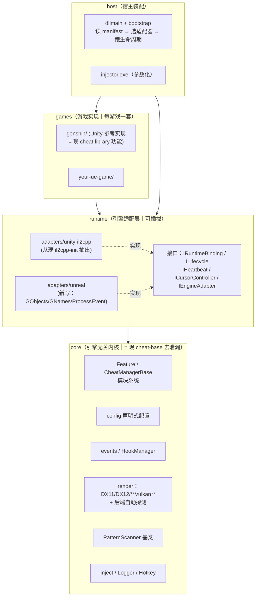
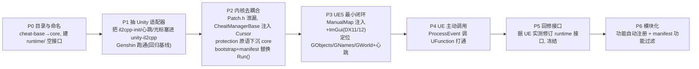

# 设计文档 · 通用化游戏修改框架改造方案

> 状态：设计定稿（关键决策已确定，见 §12）｜ 目标读者：框架二次开发者 ｜ 关联记忆：把 Akebi-GC 改造成同时支持 Unity(IL2CPP) 与 UE 的通用框架
>
> 本文只做**架构设计**，不含实现代码。目标是给出一套可落地的分层、接口与迁移路径，使本项目从"Genshin 专用作弊器"演进为"引擎无关、模块化、可配置的进程内修改框架"，并明确 Unity 与 Unreal Engine 两条适配路线各自的复用与重写边界。
>
> **首个 UE 目标已锁定为 UE5、图形 API 为 DX11/DX12、需要主动 ProcessEvent 调用蓝图、反作弊对抗内建于框架**（详见 §12）。全文相关章节已据此收敛。

---

## 一、目标与设计原则

### 1.1 目标

1. **引擎无关内核**：核心框架（现 `cheat-base`）不假设目标是 Unity、更不假设是 Genshin。
2. **双引擎适配**：以可插拔的"引擎适配层"支持 Unity(IL2CPP) 与 Unreal Engine，未来可扩展 Mono、纯原生。
3. **模块化**：功能（Feature）以插件式注册，新增功能不改动内核；理想状态下也不改动中央注册表。
4. **可配置化**：不仅游戏内功能参数可配置（现已具备），**框架自身的行为**（目标进程、注入方式、运行时类型、渲染后端、心跳源）也上提为显式配置/清单（manifest）。

### 1.2 核心设计洞察（最重要的一条）

> **Unity 与 UE 唯一能被统一抽象的层，恰好就是 `cheat-base` 现在的样子：一个"注入进程 + 渲染循环 + 每帧心跳 + 函数 Hook + 声明式配置 + ImGui 叠加"的骨架。再往上（对象模型、反射、函数调用约定）两个引擎无法统一。**

因此本方案的策略是：

- **统一到骨架层为止**——把骨架打磨成干净的引擎无关内核 + 一组窄接口。
- **不统一游戏语义**——不试图把 Unity 的 `BaseEntity` 与 UE 的 `AActor` 抽象成同一个"GameObject"。每个引擎、每个游戏各自实现自己的对象抽象层。强行统一是过度设计，会产出一个谁都不好用的中间层。

### 1.3 设计约束（继承自现有架构，继续强化）

- 层次边界单向：`games/* → runtime/* → core`，反向零依赖。
- 内核零引擎符号：`core` 内不得出现 `app::`、`il2cpp`、`UObject`、`GObjects` 等任何引擎符号。
- 生成代码隔离：Il2CppInspector / Dumper-7 等工具产物集中在各自适配器目录，视作只读产物。
- **反作弊内建但引擎无关**：反作弊对抗能力（调试器绕过、模块隐藏、注入痕迹清理等）内建于框架（决策见 §12），但其**通用原语**放在 `core`（保持引擎无关，形如现有的 `DebuggerBypass`），**引擎/游戏特定的对抗**放在对应 `runtime/adapters/*` 或 `games/*`。内核绝不因此引入引擎符号。

---

## 二、现状分析：可复用 vs 必须重写

基于对现有源码的实读，给出精确的复用矩阵。

### 2.1 内核层（现 `cheat-base`）——几乎整块复用

| 子系统 | 关键文件 | 引擎无关性 | 处置 |
|--------|---------|-----------|------|
| Feature 基类 | `cheat/Feature.h` | ✅ 纯抽象，零耦合 | 原样保留 |
| 功能管理器 | `cheat/CheatManagerBase.h` | ✅ 仅 2 个纯虚 `CursorSet/GetVisibility` 留给游戏层 | 保留；下沉 Profile 相关虚函数（见 §5.3） |
| 配置系统 | `config/Config.h`、`Field.h`、`fields/*` | ✅ 完全无关 | 原样保留 |
| 事件系统 | `events/event.hpp` | ✅ 完全无关 | 原样保留 |
| Hook 管理 | `HookManager.h` | ✅ Detours 封装，任意 x64 进程可用 | 原样保留 |
| 模式扫描基类 | `PatternScanner.h` | ✅ 引擎无关基类 | 保留；子类下沉到适配器 |
| 渲染后端 | `render/renderer.h`、`backend/dx11,dx12` | ⚠️ 仅 D3D10/11/12，**无 Vulkan** | 保留 + 新增 Vulkan 后端（§6） |
| 注入实现 | `inject/load-library.h`、`manual-map.h` | ✅ 通用 | 原样保留 |
| 工具集 | `Logger`、`Hotkey`、`util`、`ResourceLoader` | ✅ 通用 | 原样保留 |
| 字节补丁 | `Patch.h` | ⚠️ 第 6-7 行 `il2cppi_get_base_address()` 泄漏 | 去耦合（§5.1） |

### 2.2 游戏/引擎专属层——必须每引擎重写

| 耦合点 | 关键文件/符号 | 性质 | UE 侧对应物 |
|--------|--------------|------|------------|
| 启动生命周期 | `main.cpp` `Run()`：等 `UserAssembly.dll`→固定 Sleep→`init_il2cpp` | Unity 专属流程 | 等 `GObjects`/`GNames` 就绪 |
| 运行时绑定 | `il2cpp-init.cpp` 全部（X-Macro、校验和、扫描器） | IL2CPP 专属 | **UE5**：Dumper-7(UE5 版) 生成 SDK + GObjects/GNames 遍历；UE4SS 可作辅助 |
| 心跳源 | `cheat.cpp:181` `GameManager_Update_Hook` → `GameUpdateEvent` | Unity 专属 Hook | Hook `UWorld::Tick`/`UGameEngine::Tick` |
| 函数调用约定 | `app::` 函数指针（基址+偏移直接调用） | IL2CPP 专属 | **需主动调用**：原生函数直调 + 蓝图/UFunction 经 `ProcessEvent(UFunction*, params)`（本项目为高优先能力，见 §4.1） |
| 光标可见性 | `GenshinCM::CursorSetVisibility` | 游戏专属 | UE 游戏各自实现 |
| 游戏抽象层 | `game/EntityManager`、`Entity`、`filters` | 游戏专属 | UE `AActor`/`APawn`/`UWorld` 抽象 |
| 业务耦合（非框架必需） | `cheat.cpp` 的 `AccountChanged`、`MoveSync`；`GenshinCM` 账号/Profile 绑定 | Genshin 业务 | 各游戏按需，非框架强制 |
| 注入器 | `injector/main.cpp`：硬编码进程名、explorer 反父进程 | 半通用 | 参数化即可（§7） |

**结论**：难度最高的"内核 / 游戏"干净分层，原作者已完成约 80%。真正的工作量集中在：(a) 把隐含的 IL2CPP 假设抽象成窄接口；(b) 新写一套 UE 适配器；(c) 补 Vulkan 后端。

---

## 三、目标架构

### 3.1 分层总览



### 3.2 依赖方向（硬约束）

`core` 不依赖任何上层；`runtime/接口` 只依赖 `core`；`runtime/adapters/*` 依赖接口 + 各自的生成 SDK；`games/*` 依赖 core + 所选适配器；`host` 装配三者。**任何一条反向边都视为架构违规。**

---

## 四、核心抽象接口设计（runtime 接口层）

这是本方案的技术核心：用尽量**窄**的接口把"引擎相关的那几件事"隔离出来。接口刻意保持最小——只抽象两个引擎都必然存在、且骨架真正依赖的能力。

### 4.1 `IRuntimeBinding` —— 符号解析与函数调用

职责：把"符号名/签名"解析成"可调用地址"，屏蔽 IL2CPP 偏移与 UE GObjects 的差异。

```cpp
// runtime/IRuntimeBinding.h（草图，非最终）
namespace runtime {
    class IRuntimeBinding {
    public:
        virtual ~IRuntimeBinding() = default;

        // 运行时是否已就绪（元数据/对象表已初始化）
        virtual bool IsReady() const = 0;

        // 按符号名解析原生函数地址（Unity: 基址+偏移/扫描；UE: 依实现）
        virtual void* ResolveFunction(std::string_view symbol) = 0;

        // 取模块基址（替代 core 里泄漏的 il2cppi_get_base_address）
        virtual uintptr_t ModuleBase(std::string_view module) const = 0;

        // 主动调用能力（本项目为高优先需求：需主动触发游戏逻辑）
        // Unity: 直接对 ResolveFunction 拿到的指针发起调用即可（下面两个可空实现）
        // UE   : 蓝图/UFunction 经 ProcessEvent 触发，必须实现
        virtual bool SupportsProcessEvent() const { return false; }
        // 在 uobject 上调用 ufunction，params 为按 UE 布局打包的参数缓冲区
        virtual void ProcessEvent(void* uobject, void* ufunction, void* params) { }
        // 按名字查找 UFunction（UE 专用；Unity 返回 nullptr）
        virtual void* FindFunction(void* uobject, std::string_view funcName) { return nullptr; }
    };
}
```

> 说明：本项目**需要主动调用蓝图/UFunction**（决策 §12），因此 `ProcessEvent` 从"可选"升级为 UE 适配器的**必做能力**，在接口里升为一等成员而非事后扩展。Unity 的调用直接对 `ResolveFunction` 的指针发起，不走这条路径（两个方法空实现）。UE 的原生函数也走 `ResolveFunction`，只有蓝图/UFunction 走 `ProcessEvent`。这条差异无法抹平，故显式建模而非强行统一。参数打包（UE 的 `params` 结构布局）由 UE 适配器结合生成 SDK 负责，`core` 不感知。

### 4.2 `ILifecycle` —— 启动生命周期钩子

把现在 `Run()` 里硬编码的"等 DLL → Sleep → init → cheat::Init"抽象成阶段钩子，由 bootstrap 依次驱动。

```cpp
namespace runtime {
    class ILifecycle {
    public:
        virtual ~ILifecycle() = default;

        // 阻塞直到运行时可初始化（Unity: 等 UserAssembly.dll；UE: 等 GObjects/GNames）
        virtual void WaitForRuntime() = 0;

        // 解析全部符号/偏移（Unity: init_il2cpp；UE: 定位 GObjects/GNames/GWorld）
        virtual void InitBinding() = 0;

        // 返回该引擎的心跳源与光标控制器（见 4.3 / 4.4）
        virtual IHeartbeat*        Heartbeat() = 0;
        virtual ICursorController* Cursor()    = 0;
    };
}
```

### 4.3 `IHeartbeat` —— 每帧心跳源

`GameUpdateEvent` 是全项目"每帧逻辑"的心跳。它的来源是引擎专属的，必须抽象。

```cpp
namespace runtime {
    class IHeartbeat {
    public:
        virtual ~IHeartbeat() = default;
        // 安装心跳 Hook：每帧触发时调用 tick()
        // Unity: Hook GameManager.Update
        // UE   : Hook UWorld::Tick / UGameEngine::Tick
        // 兜底 : 若无合适 tick，可退化为渲染线程 RenderEvent 驱动
        virtual void Install(std::function<void()> tick) = 0;
    };
}
```

> 兜底策略很关键：UE 定位稳定的逐帧 tick 比 Unity 略麻烦。允许某些游戏先用**渲染帧**（现有的 DX Present Hook → `RenderEvent`）作为心跳，把"逻辑心跳"与"渲染心跳"合流，先跑通再优化。

### 4.4 `ICursorController` —— 光标可见/锁定

对应现 `CheatManagerBase` 的两个纯虚函数，从"游戏管理器子类"下沉为独立小接口，便于跨游戏复用。

```cpp
namespace runtime {
    class ICursorController {
    public:
        virtual ~ICursorController() = default;
        virtual void SetVisibility(bool visible) = 0;
        virtual bool GetVisibility() = 0;
    };
}
```

### 4.5 `IEngineAdapter` —— 适配器聚合入口

一个引擎适配器 = 上述能力的组合 + 工厂。bootstrap 只跟这一个门面打交道。

```cpp
namespace runtime {
    class IEngineAdapter {
    public:
        virtual ~IEngineAdapter() = default;
        virtual const char* Name() const = 0;                 // "unity-il2cpp" / "unreal"
        virtual ILifecycle&        Lifecycle() = 0;
        virtual IRuntimeBinding&   Binding()   = 0;
        virtual renderer::DXVersion PreferredBackend() const = 0; // 或扩展含 Vulkan 的枚举
    };

    // 由 manifest 里的 runtime 字段选择具体适配器
    IEngineAdapter* CreateAdapter(std::string_view engineId);
}
```

### 4.6 接口设计的自我约束

- **窄**：只抽象两个引擎都存在、且 core 真正依赖的能力。凡是"只有一个引擎需要"的东西（如 UE 的 ProcessEvent、Unity 的账号系统），要么用可选虚函数带默认实现，要么留在各自 `games/` 层，**绝不上提为强制接口**。
- **先有两个真实实现再固化接口**：接口只对着一个引擎设计几乎必然是错的。落地顺序上，Unity 适配器从现有代码抽出（已验证），UE 适配器打通最小闭环后，**回头修订接口**，再冻结。

---

## 五、内核层改造点（core / 现 cheat-base）

### 5.1 去除 IL2CPP 泄漏

`Patch.h:6-7` 的 `OPatch/OUnpatch` 宏直接调用 `il2cppi_get_base_address()`。改为经 `IRuntimeBinding::ModuleBase()` 取基址，或把这两个宏移出 core、下沉到 Unity 适配器（它们本就是"基址+偏移"的 Unity 用法）。

### 5.2 渲染后端枚举扩展

`renderer::DXVersion { D3D10, D3D11, D3D12 }` 扩展为包含 `Vulkan`（或引入更中性的 `GraphicsAPI` 枚举）。详见 §6。

### 5.3 CheatManagerBase 瘦身

- `CursorSet/GetVisibility` 两个纯虚：改为持有 `ICursorController*`，由 bootstrap 注入，**从此不再要求每游戏都子类化管理器**。
- Profile/账号相关虚函数（`DrawProfileEntry*` 等）：当前默认实现偏向"账号绑定 Profile"。保留基础 Profile 机制（多档案本身是通用的），但把**账号↔Profile 自动绑定**这类业务从基类默认行为里剥离，改为可选 mixin，Genshin 继续用，UE 游戏可不用。

### 5.4 保持 `config` / `events` / `HookManager` 不变

这三者已完全通用，改造中作为稳定基座，不动接口。

### 5.5 内建反作弊对抗子系统（决策 §12）

反作弊对抗**内建于框架**，而非交给各游戏层。按"通用原语在 core、特定对抗在适配器/游戏"分层：

- **`core/protection/`（引擎无关原语）**：把现散落在 Genshin 层的手段沉淀为通用能力——调试器绕过（现 `DebuggerBypassPre/Post` 的通用化）、注入痕迹清理（抹 PE 头 / 从 PEB 卸链模块）、线程隐藏、Hook 完整性自检。这些不依赖任何引擎符号，任意目标可复用。生命周期上由 bootstrap 在 `ILifecycle::WaitForRuntime` 前后择机调用（对应现 `Run()` 里 `DebuggerBypassPre/Post` 夹住等待游戏就绪的位置）。
- **`runtime/adapters/*` 与 `games/*`（特定对抗）**：针对具体反作弊系统（如某 UE5 游戏的 EAC/BattlEye、或 IL2CPP 特有检测）的对抗留在对应层，作为可插拔策略挂到 core 的 protection 框架上。**首个 UE5 目标已确认带强反作弊（§12）**，故这部分是 P3+ 的实打实投入项，不是可选装饰——注入走 ManualMap、`protection` 各项默认开，并需针对该反作弊系统单独维护对抗策略。
- **可配置开关**：每项对抗能力经 manifest（§8.3）单独开关——单机/无强反作弊目标可整体关闭，避免不必要的风险与兼容问题。
- **边界声明**：具体反作弊系统的对抗是一场持续对抗、且与目标强绑定，本框架只提供**机制与挂载点**，不承诺对任何特定反作弊的绕过效果；对抗策略本身随目标逐一维护。

---

## 六、渲染层：复用现有 DX 后端，Vulkan 推迟

> **决策收敛（§12）**：首个 UE5 目标用 DX11/DX12 渲染，因此**现有 DX11/DX12 后端可直接复用，Vulkan 后端不再是本期阻塞项**，降级为按需的后续增量。

- **本期**：沿用 `render/backend/dx11`、`dx12`。UE5 的 DX12 swapchain 与 Unity 的 DX11 在 Hook 层面差异不大，现有 DX12 后端应能覆盖；如遇 UE5 特定的 swapchain 行为再做适配。
- **后端自动探测**：bootstrap 阶段探测目标进程加载了哪个图形模块（`d3d11.dll` / `d3d12.dll`），或读 manifest 显式配置。`IEngineAdapter::PreferredBackend()` 给出建议值，manifest 可覆盖。
- **Vulkan（推迟，非本期）**：预留 `render/backend/vk-hook.*` 的位置——Hook `vkQueuePresentKHR`（及 `vkCreateSwapchainKHR` 处理重建），接 ImGui 的 Vulkan 后端，触发同一个 `RenderEvent`，对 core 其余部分透明。仅当出现 Vulkan 目标时再实现。为此 `render` 的图形 API 枚举仍建议扩展出 `Vulkan` 占位（§5.2），避免将来改接口。
- **输入锁与字体**：`renderer` 现有的输入锁 / 字体缩放逻辑与后端解耦，任何后端复用，无需改动上层。

---

## 七、注入器通用化（injector）

现 `injector/main.cpp` 硬编码 `GenshinImpact.exe`/`YuanShen.exe` 与 explorer 反父进程。改造：

- **进程与路径参数化**：进程名列表、可执行路径、命令行、是否 explorer 反父进程、注入方式（LoadLibrary/ManualMap）、注入后等待时长——全部读 `cfg.ini`（现已有 `[Inject]` 段，扩展字段即可）。
- **反父进程可选**：explorer 反父是规避特定反作弊的手段，对普通 UE 单机游戏往往不需要，做成开关。
- **DLL 名参数化**：现已支持 `argv[1]` 覆盖 `CLibrary.dll`，保留。

注入器与引擎类型无关（它只管把 DLL 塞进目标进程），因此**不需要为 UE 单独写注入器**，参数化即可覆盖。

---

## 八、模块化与可配置化机制

### 8.1 功能自动注册（消除中央注册表）

现状：新增功能必须手动改 `cheat.cpp` 的 `AddFeatures({...})`（`cheat.cpp:81`）。

改造：引入编译期自动注册器——功能在自身 `.cpp` 里用一行宏把 `GetInstance` 登记到全局注册表，bootstrap 遍历注册表装配。新增功能**只加文件，不改注册中心**，这才是真正的模块化。

```cpp
// 目标用法（草图）
REGISTER_FEATURE(GodMode);   // 展开为一个静态注册对象
```

> 权衡：静态初始化顺序需谨慎（注册器必须在 manager 装配前就位）。可用 Meyers 单例 + 首次访问注册，规避 SIOF。

### 8.2 功能分组按需链接

把功能按引擎/游戏组织成子库或按 manifest 过滤，允许一个宿主只编译/加载它需要的功能集。跨游戏可共享的"引擎无关功能"（如 FPS 显示、纯 ImGui 工具）可放 `games/common/`。

### 8.3 框架级 manifest（新增，配置化的关键）

现在"目标是什么引擎、心跳从哪来、用哪个渲染后端"散落在代码里。上提为一份声明式清单：

```jsonc
// framework.manifest.json（草图，示例为首个 UE5 目标）
{
  "target": {
    "process": ["YourUE5Game.exe"],
    "reparentToExplorer": true,       // 首个 UE5 目标带强反作弊(已确认)，倾向开启
    "inject": "ManualMap"             // 强反作弊目标定为 ManualMap
  },
  "runtime": "unreal",                // 选择引擎适配器：unity-il2cpp | unreal
  "render":  "auto",                  // auto | d3d11 | d3d12（vulkan 预留，未实现）
  "protection": {                     // 内建反作弊对抗，逐项开关（§5.5）；强反作弊目标默认全开
    "debuggerBypass": true,
    "unlinkModule":   true,
    "eraseHeaders":   true,
    "hookIntegrity":  true
  },
  "features": ["*"]                   // 或白名单
}
```

bootstrap 读取 manifest → 按 `protection` 启用对抗原语 → `CreateAdapter(runtime)` → 跑 `ILifecycle` → 选渲染后端 → 装配 features。**同一套二进制，靠 manifest 切换运行时行为**；但生成 SDK 是 per-game 编译期维度，切不了（见 §11 与 §12 决策 5）。

---

## 九、目标目录结构

```
core/                         # = 现 cheat-base（去 IL2CPP 泄漏、加 Vulkan）
  cheat/  config/  events/  render/{backend/dx11,dx12,vk}  inject/  ...
runtime/
  IRuntimeBinding.h  ILifecycle.h  IHeartbeat.h  ICursorController.h  IEngineAdapter.h
  adapters/
    unity-il2cpp/             # 从现 il2cpp-init.cpp / helpers 抽出
      binding.*  lifecycle.*  heartbeat.*  (X-Macro 绑定, 校验和, ILPatternScanner)
    unreal/                   # 新写
      binding.*  lifecycle.*  heartbeat.*  (GObjects/GNames/ProcessEvent/UWorld::Tick)
      sdk/                    # Dumper-7 / UE4SS 生成产物（只读）
games/
  common/                     # 引擎无关的可复用功能（可选）
  genshin/                    # = 现 cheat-library 的功能 + game/ 抽象（Unity 参考实现）
    cheat/{player,world,...}  game/{EntityManager,Entity,filters}  appdata/(生成)
  your-ue-game/               # UE 目标：AActor/UWorld 抽象 + 功能
host/
  bootstrap.*                 # 读 manifest → 装配（替代现 main.cpp 的 Run）
  dllmain.cpp                 # 仅起线程跑 bootstrap（现 dllmain 已足够通用）
injector/                     # 参数化后的通用注入器
framework.manifest.json
```

---

## 十、迁移路径（分阶段，全程保持 Genshin 可用）

> 原则：每一步都可编译、可回归。Genshin 作为"第一个消费者"贯穿始终，充当抽象是否正确的活体测试。



- **Vulkan 已移出主路径**：目标为 DX11/DX12，P3 直接复用现有 DX 后端；Vulkan 作为将来出现 Vulkan 目标时的独立增量，不在 P0–P6 内。
- **P1 是安全网**：在不引入 UE 的前提下，仅把现有 Unity 代码"搬"进适配器并保持 Genshin 功能不回归。这一步把重构风险和 UE 未知风险解耦。
- **P3→P4 分两步**：先只求"能注入+能渲染+能读到世界+有心跳"的只读闭环（P3），再单独打通**主动 ProcessEvent 调用**（P4）——后者是本项目明确需求（§12 决策 3），但依赖 P3 已能稳定拿到 `UObject`/`UFunction`，故拆开降低风险。
- **P4 之前不要冻结接口**：§4.6 的原则——主动调用闭环跑通后（P5）才据两个真实实现修订并冻结 `runtime` 接口。P0–P4 的接口都视为可变草案。
- **P3 最小闭环验收标准**：能 ManualMap 注入目标 UE5 进程、F1 弹出 ImGui（DX11/12）、定位到 `GObjects`/`GNames`、拿到 `GWorld`、心跳事件每帧触发。不要求任何具体功能。
- **P4 验收标准**：能按名字查到某个 `UFunction` 并经 `ProcessEvent` 主动调用一次、参数正确生效（例如调用一个可观测副作用的蓝图函数）。

---

## 十一、风险与权衡

| 风险 | 影响 | 缓解 |
|------|------|------|
| **UE5 绑定是另一套工具链** | 工作量大头。UE 无 IL2CPP，需 Dumper-7(UE5 版)/UE4SS 生成 SDK，理解 GObjects/GNames/FName/ProcessEvent | 视为独立子项目；P3 只求最小闭环，不追求功能对等 |
| **UE5 主动调用参数打包易错** | 本项目需主动 `ProcessEvent` 调蓝图（§12 决策 3），`params` 结构布局必须与 UE5 SDK 精确一致，错了会崩或行为异常 | P4 单独验证；参数打包严格依生成 SDK，先用有可观测副作用的简单函数验证 |
| **"同一二进制切换目标"做不到完全** | 生成 SDK（appdata / UE sdk）是 per-game 编译期产物，manifest 只能切运行时行为，切不了 SDK | 已定为**每目标独立 host 产物**（§12 决策 5）；manifest 只管运行时装配 |
| **UE5 tick 心跳定位不稳** | 找不到稳定逐帧 tick 会导致心跳缺失 | `IHeartbeat` 提供渲染帧兜底（§4.3），先合流再优化 |
| **抽象过早固化** | 只对 Unity 设计的接口套不上 UE | §4.6 + P5：两个真实实现后再冻结 |
| **静态注册 SIOF** | 功能自动注册的初始化顺序问题 | Meyers 单例 + 首次访问注册 |
| **反作弊对抗内建的维护成本** | 决策为框架内建（§12 决策 4），但具体反作弊是持续对抗、与目标强绑定，易膨胀 | core 只提供通用原语+挂载点（§5.5），特定对抗留适配器/游戏层且可 manifest 关闭；不承诺对特定反作弊的效果 |
| **过度抽象游戏语义** | 想统一 Entity/Actor 会产出难用中间层 | 明确不做（§1.2）；游戏抽象层留在各 `games/*` |
| **Vulkan（已出主路径）** | 将来若出现 Vulkan 目标才需要 | 现目标 DX11/12 无此风险；接口预留占位（§5.2/§6），届时独立增量 |

---

## 十二、关键决策（已确定）

以下决策已拍板，全文相关章节据此收敛。

| # | 决策项 | 结论 | 对设计的影响 |
|---|--------|------|-------------|
| 1 | **首个 UE 目标引擎版本** | **UE5** | SDK 工具链走 Dumper-7 的 UE5 版（UE4SS 辅助）；GObjects/GNames/FName 按 UE5 布局。见 §2.2、§9 `adapters/unreal/sdk`。 |
| 2 | **目标游戏图形 API** | **DX11/DX12** | **Vulkan 移出主路径**，复用现有 DX 后端；Vulkan 仅预留占位。见 §6、§10（P3 直接用 DX）、§11。 |
| 3 | **是否主动调用蓝图/UFunction** | **需要主动调用** | `IRuntimeBinding` 的 `ProcessEvent`/`FindFunction` 从可选升为 UE 适配器**必做一等能力**；迁移路径单列 P4 验证主动调用。见 §4.1、§10。 |
| 4 | **反作弊对抗层级** | **框架内建** | 新增 §5.5 内建 protection 子系统：通用原语在 `core/protection/`，特定对抗在适配器/游戏层，经 manifest 逐项开关。见 §1.3、§5.5、§8.3。 |
| 5 | **多目标发布形态** | **每目标独立 host 产物**（推导确定） | 因生成 SDK 是 per-game 编译期产物，manifest 无法切换 SDK，故不追求"同一二进制切多游戏"；manifest 只管单个产物内的运行时装配。见 §8.3、§11。 |

> 决策 5 未在讨论中单独提出，是基于"SDK 是编译期 per-game 维度"这一技术事实推导得出的合理默认。若你更希望"同一二进制经 manifest 切换多个 Unity 目标"（对 Unity 侧技术上可行，对含 UE 的混合发布不现实），可提出，我据此调整 §8/§9/§11。

### 后续补充确认（P0–P2 不受影响）

- **首个 UE5 目标带强反作弊**（已确认）：目标存在强反作弊（EAC/BattlEye 级）。据此：注入方式定为 **ManualMap**；§5.5 需投入**针对该反作弊系统的特定对抗策略**（放 `adapters/unreal` 或 `games/<ue-game>`）；§8.3 manifest 的 `reparentToExplorer` 倾向开启、`protection` 各项默认开。这些集中在 P3+ 兑现，**不影响 P0–P2**。
- **首个 UE5 具体游戏名**（已锁定，名称待补录）：用户已锁定具体 UE5 游戏，游戏名待补录到本文与项目记忆；影响 P3 的 SDK 生成（Dumper-7 UE5 版）与特定对抗细节。当前设计对具体游戏无硬依赖，P0–P2 按通用 UE5 推进即可。

---

## 附：一句话总结

> 内核（cheat-base）已经是一个引擎无关的好骨架；本方案把它隐含的 IL2CPP 假设抽象成 `runtime` 窄接口，Unity 适配器从现有代码抽出（低风险），**UE5 适配器新写（工作量大头，含主动 ProcessEvent 调用）**，反作弊对抗原语下沉 core 并 manifest 化，把"目标是什么"从代码上提为 manifest。**图形 API 锁定 DX11/12 后 Vulkan 已出主路径；难的分层作者做完了，剩下的是抽接口、写 UE5 适配（含主动调用）、内建 protection——且务必先用 Unity+UE5 两个真实引擎校准接口再冻结。**
